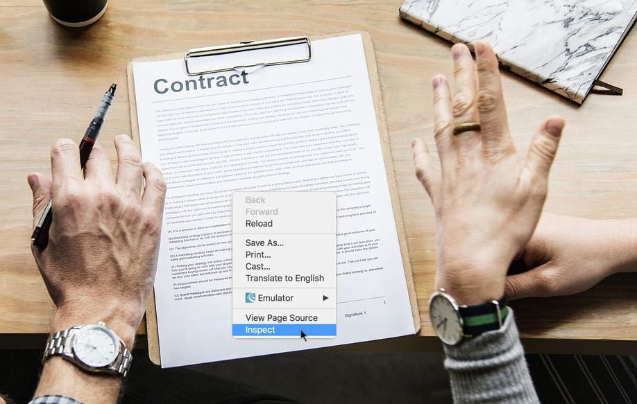
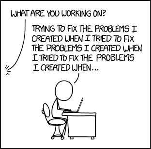

**_Earlier this month the VGSD — Verband der Gründer und Selbstständigen Deutschland e.V. — held an online presentation with lawyer Julia Gertz, who specializes in IT contracts and showed us how to identify unfair service contracts._**

_Please note that we are not lawyers and this post should not be taken as legal advice! Every contract is unique, so if you have one on the table, get it checked by an actual lawyer! (scroll down for Julia Gertz's contact info)_

When the client sets out the rules of how they want to work with the freelancer, it is the case, more often than not, that those rules work in the client’s favor. There seems to be a common belief that, as the smaller party with less legal assertiveness, we have no choice but to accept these rules But our position is stronger than we think: It pays off to inspect the contracts and demand changes to create a level playing field.

## Werkvertrag vs. Dienstvertrag

_contract to produce a work vs. contract for service_

One important distinction is to know whether you are selling your creation (work) or your time (service). This sets the legal framework of your rights and obligations — and sometimes a tiny difference in wording can make a big difference.

A classic example of a **Werkvertrag** is if you agree to get paid to write a piece of software based on a set of requirements. In this case, you have to ensure that all the specifications are met and give a guarantee (Gewährleistungspflicht) of the software’s functionality . This implies that you have to fix it if it doesn't work as expected – without any additional payment and even if the contract period has ended. And we all know how dangerous that can be...

In a **Dienstvertrag** you are selling your service, or rather, your time. This is generally the preferred way of doing things, as you have fewer obligations: You cannot legally be held responsible for your work and are not required to fix anything after your contract has ended. It can happen that in the case of a legal dispute, a contract, which on first sight looks like a Dienstvertrag, can be ruled by a court as a Werkvertrag — obviously to your disadvantage.

Indicators that your contract is a Dienstvertrag:

- you are getting paid for "support" or "consulting"
- you are getting a monthly payment which is _not_ an advance payment
- there is no passage about warranty
- there is no passage about the approval of your work

A short note on **Sittenwidrigkeit** (unconscionability): There is little legal protection in B2B contracts, the field of possibilities is wide before a passage may be ruled as unlawful in the case of a court decision. The legislator is basically saying »Wer lesen kann ist klar im Vorteil« (Those who can read are clearly at an advantage) and assumes that both parties consciously agree on what they are signing.

## Unfair Liability

Some contracts contain passages like the following:

> _The contractor_ **_ensures_** _to be knowledgeable in his or her field of expertise to provide the requested service. [...]_

> _Der Auftragnehmer **sichert zu** , das für die Erbringung der vereinbarten Leistung erforderliche Fachwissen zu besitzen. [...]_

Let's say you are working in a team of engineers, and because of your[commits from last night](http://www.commitlogsfromlastnight.com/), a team member claims you don't know what you're doing. If your contract contains something like the passage above, your client could make claims for compensation until you prove that you, in fact, do have the required expertise. If you can't, the client may even withdraw from the contract and you will have to return any payments you received.

Another sneaky passage might be the following:

> _[...] to provide the requested service._ In addition, the Freelancer guarantees to appear at the Customer's premises with an appropriate appearance (dress code). **The Freelancer shall be liable in accordance with the legal regulations.**

> _[...] erforderliche Fachwissen zu besitzen._ Außerdem sichert der Auftragnehmer zu, beim Kunden mit angemessenem äußerlichen Erscheinungsbild (Kleiderordnung) aufzutreten. **Der Auftragnehmer haftet nach den gesetzlichen Regelungen.**

An ambiguous passage like the part in **bold** one holds you liable for all damage during or related to the job, including the server you accidentally spilled coffee on or the car you accidentally scratched on your way to work. To give you a really scary example: Let's say you include a library into a project for which a vulnerability was found long after you completed the project. **Based on the passage above, you may be held liable for any damage caused by security leaks which can be traced back to that library you included.** It would be advisable to restrict your liability to reduce unforeseeable risks.

> If the freelancer acts negligently he is liable for damages. If the damage lies in the defective performance of a contract-related service and can be repaired through rework, the freelancer **is liable to repair those damages.**

> Soweit der freie Mitarbeiter fahrlässig handelt, haftet er für Schäden. Soweit der Schaden in der mangelhaften Erbringung einer auftragsbezogenen Dienstleistung liegt und durch Nacharbeit behoben werden kann, **muss diese Nacharbeit geleistet werden**.

The first sentence restricts your liability for damages caused by negligence, which is normal and fair. The part in **bold** sneaks in a warranty for your work, which doesn't belong in a contract for service. If you are taken to court with this contract, it may be ruled as a contract for work; therefore, its respective legal framework applies.

## Unfair Payment

Let's say you are working with an external recruiter and they are asking you to sign a contract which includes the following passage:

> The contractor may only claim his right for compensation for the provided work or services if {{recruiter}} received compensation for the work or service of the contractor from {{customer}}.

> Der Auftragnehmer hat nur dann Anspruch auf Vergütung bereits erbrachter Leistungen, wenn {{Recruiter}} vom Kunden eine Vergütung für die Leistung des Auftragnehmers erhalten hat.

This passage renders you helpless if the customer doesn't pay the recruiter, whatever the reason may be: you can't make any legal claims neither to the customer nor the recruiter.

Also be careful about payment deadlines. There is no German law that limits them – and the longer your client is allowed to withhold payment, the riskier it is for you. A 45-day payment target is unreasonable for a one-man show.

Note: You can reduce the risk of a payment default on long payment targets through **factoring** , i.e. using a service that pays you 80-90% of your bill now and the rest when the customer settles up. This usually costs 3-4% of the amount in question.

## Unfair Term of Notice

By default it's up for definition how the contract may be terminated. Be careful if you see something like this:

> The Recruiter may terminate the contract with one weeks notice.

> Der Vermittler kann den Vertrag mit einer Frist von einer Woche kündigen.

Sometimes, middlemen permit themselves to terminate a contract while prohibiting you from doing so. This is simply unequal and should be balanced out, so both parties play by the same rules.

## Don't hesitate to request changes!

To give you a rule of thumb for your contracts: It's not unalterable just because it's printed on paper! If you believe a certain passage in your contract to be to your disadvantage, be brave and tell your contracting partner. The contract they send you is just a proposal; you are free to make a counterproposal. Make sure to ask your contracting partner whether they, or someone in close proximity, have the competence to edit the contract, and include suggestions on how you would like to word the passage instead. There are a number of freelancer's at Uplink who successfully changed their client's contract to balance out their rights and liabilities.

And as Julia Gertz said: Give it a try, it works! Stay friendly and objective, educate yourself on the topic in question and explain your request for changes thoroughly to avoid long and tiresome &nbsp;discussions.

If you have any questions regarding your contract, don't hesitate to contact Julia Gertz! You will get a special rate if you tell her about your Uplink Membership =)

---

_Fair and unfair contracts are only one of the many topics discussed in our network [Uplink](https://uplink.tech/). More than 500 members have already joined us in building a strong and vibrant community of IT freelancers. We post simple, fair and transparent job offers for our members, host lots of lively discussions in our Slack workspace and meet up for beers regularly in real life to get to know and support each other. If you're a Germany-based IT freelancer, [join us](https://uplink.tech/freelancer/)! And if you're a company looking for a experienced freelancer, [get in touch as well](https://uplink.tech/)!_
