On February 7 we invited our freelancer community to our first "IPAs and APIs" meetup of 2019 to [Labor](https://www.facebook.com/LaborBerlinKraftBeerBar/) in Berlin-Friedrichshain. Our sponsor this time was [Equal Experts](https://www.equalexperts.com/) (thanks!) and it was again a fantastic evening with lots of old and new faces and interesting conversations about life, freelancing, and everything else.

Moreover, on this 8th meetup, we finally managed to get some photos taken! (thanks to Daniel Schmude of [Launch Fotostudio](http://www.launchfotostudio.com/))

<!--truncate-->

Here are some impressions of the evening in Berlin:

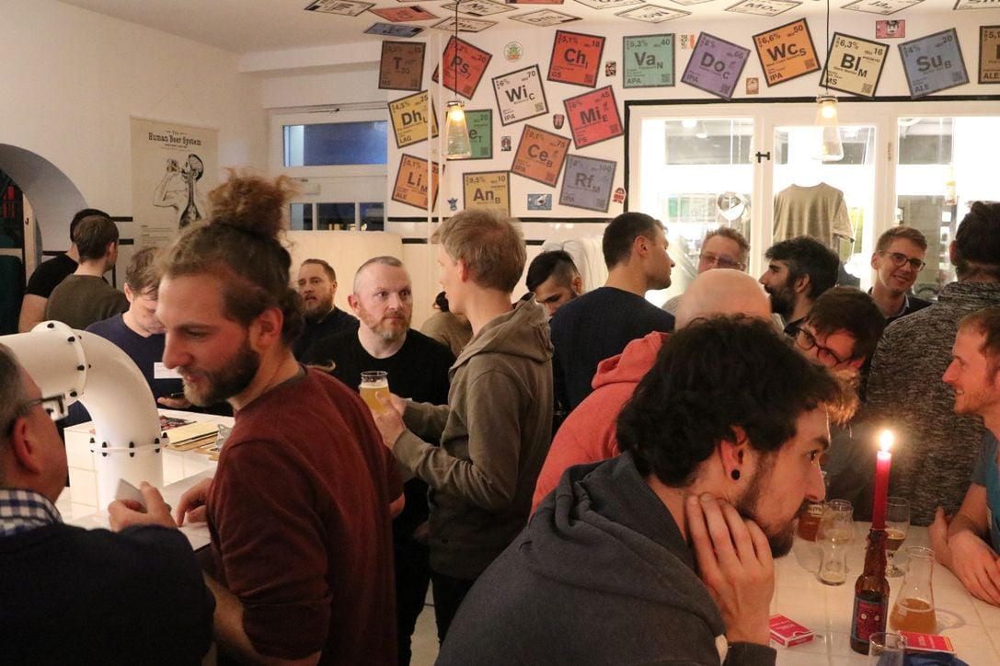

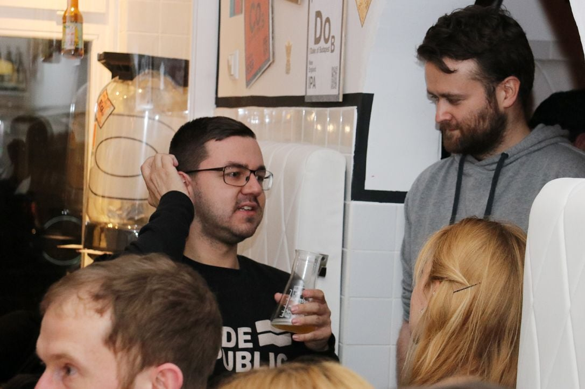

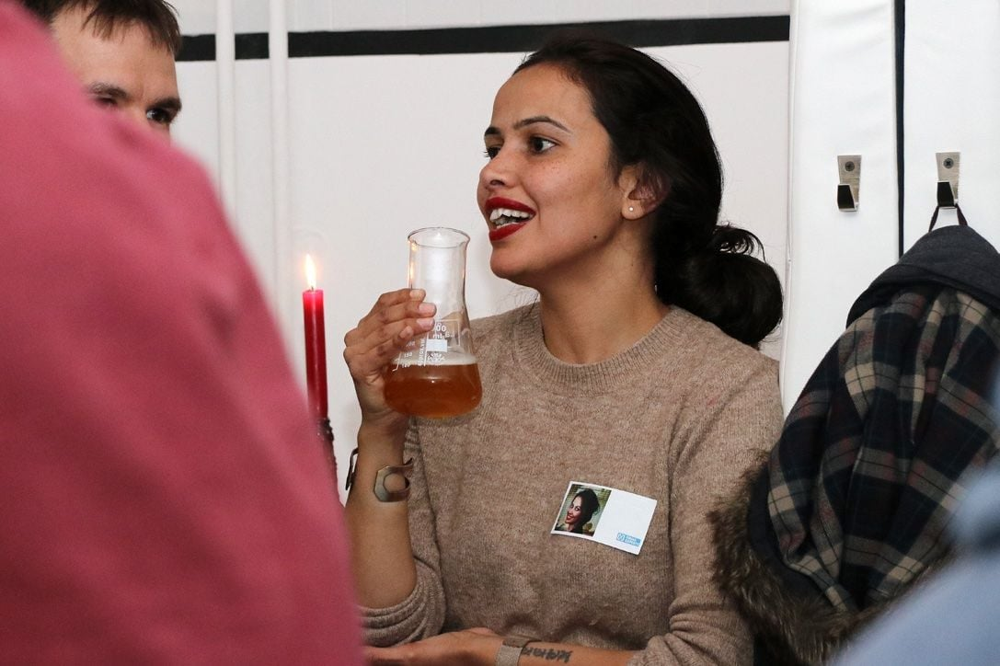

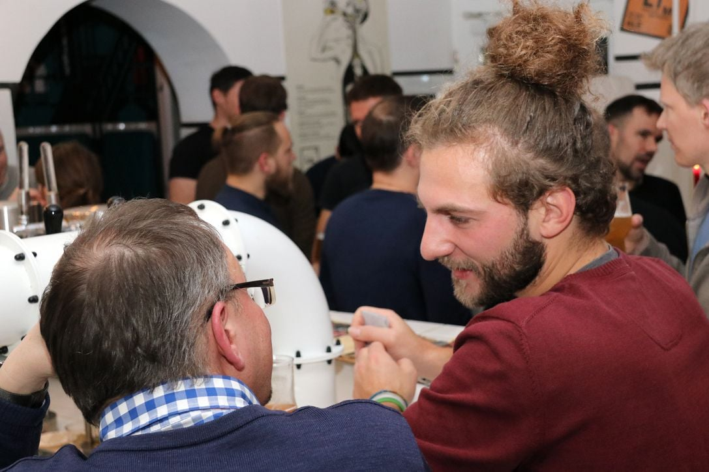

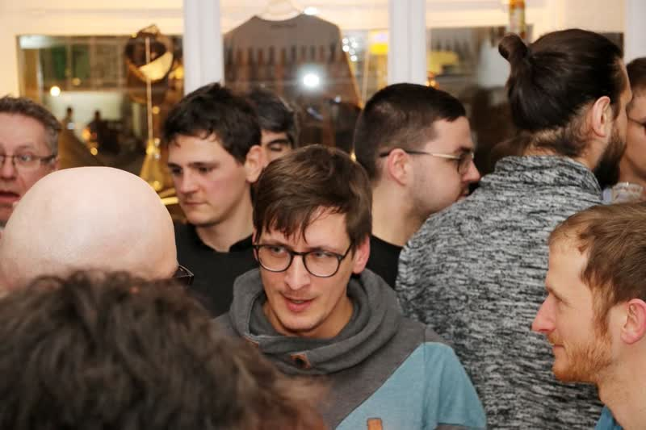

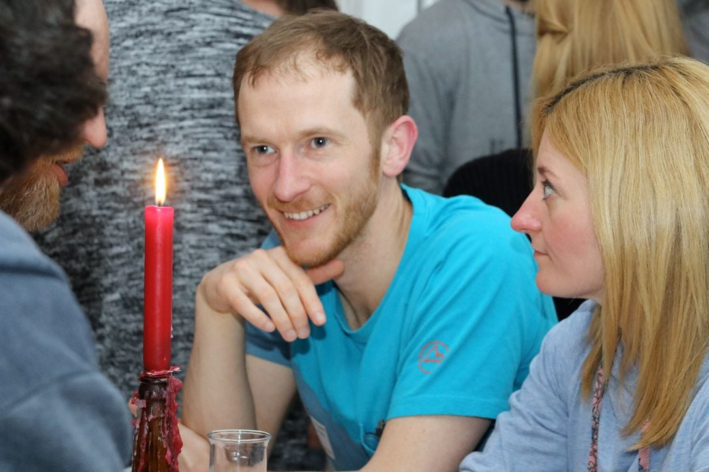

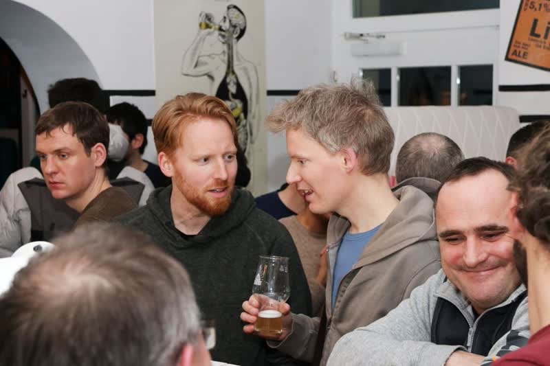

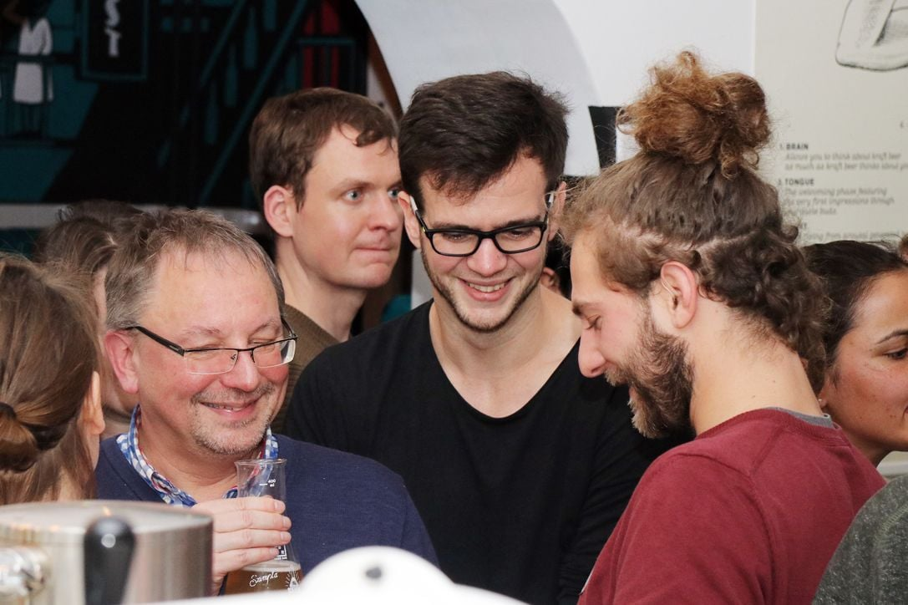

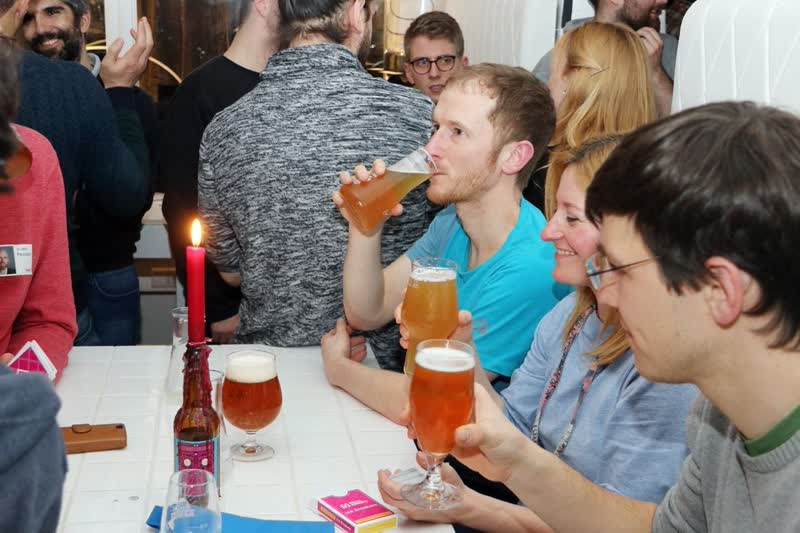

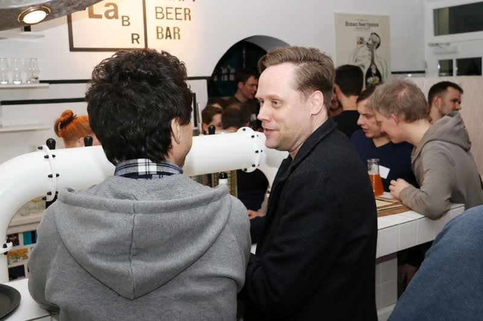

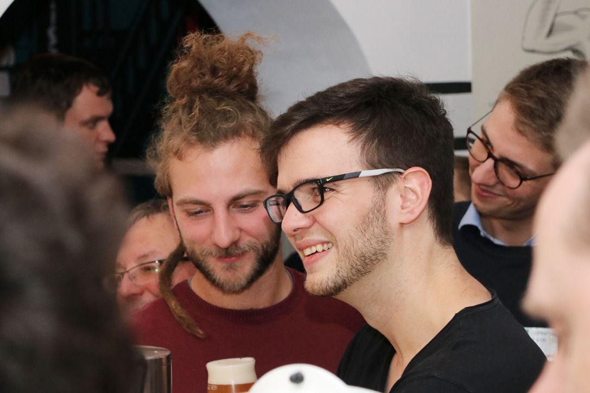

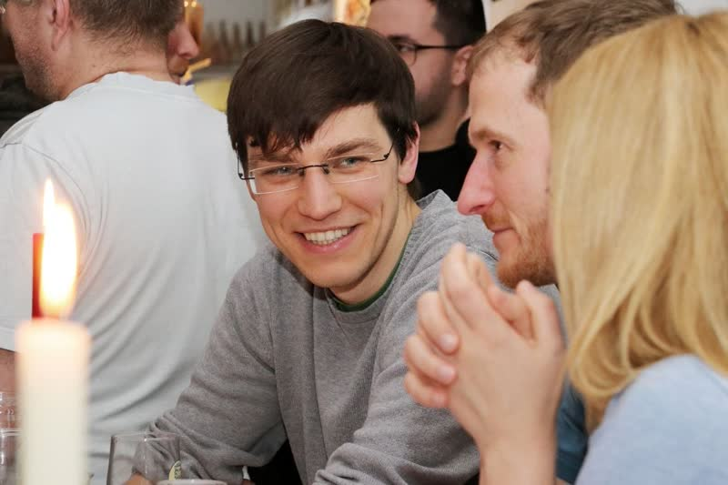

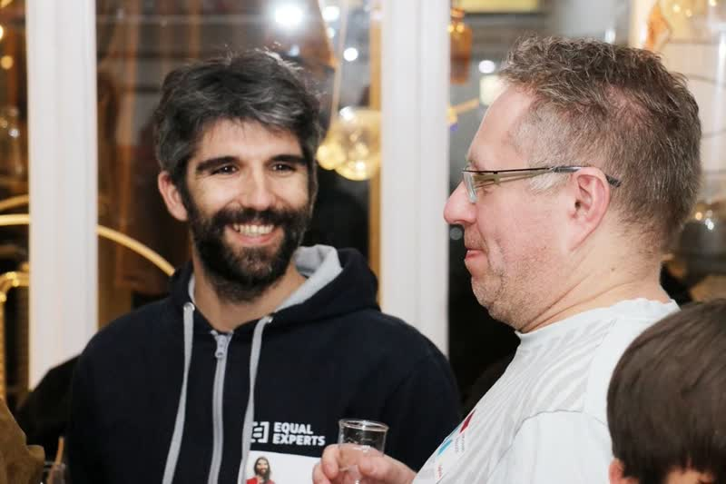

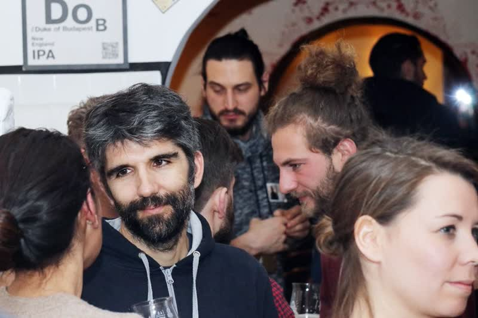

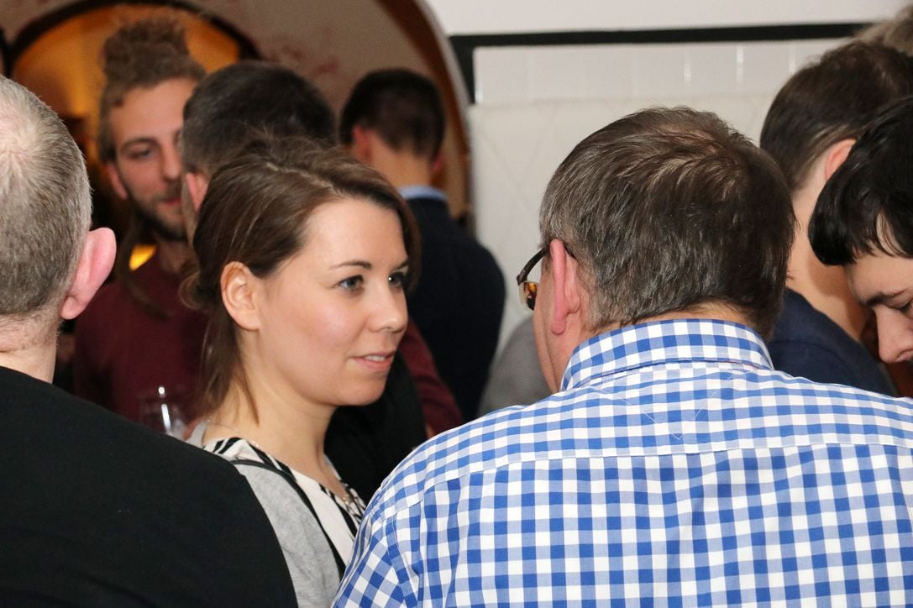

We organize these community meetups every two months in a different craft beer bar in Berlin. Also, we are currently working on our first meetup in Hamburg on March 22, so if you are a member of Uplink from the Hansestadt, come out to meet us and your fellow Uplinkers for some cold brews! You can find more info in the [member area](https://my.uplink.tech/community/events) (and if you're not a member yet, [head over here to sign up](https://uplink.tech/freelancer/#apply)!)
