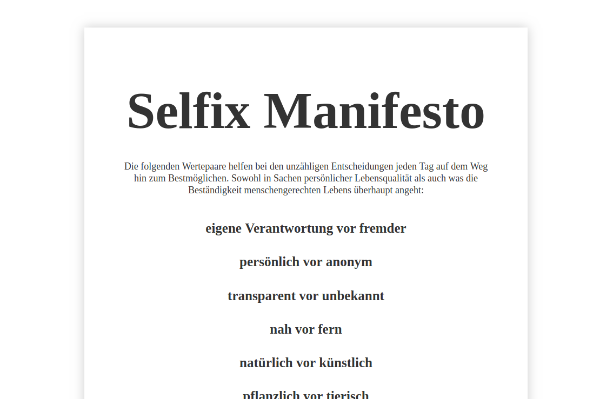

_Did you ever wonder what other Uplink members are working on? We did. That's why we decided to showcase projects of community members in our blog and would like to present our first interview!_

Our subject is Gerold Kirchner. Gerold and I met in an Asian restaurant in Berlin-Charlottenburg to talk about his upcoming project which he has been planning for a while: a circle of freelancers working together as a team to reduce the isolation of working solo.

**Henrik** : Hey Gerold, thanks for taking the time to talk about your project! I have these “Ice Breaker Cards” with me, which one of our clients, Equal Experts, brought to our most recent community meetup and found a nice question to start this interview. May I?

**Gerold** : Sure, go for it!

**Henrik** : Alright. What was your first memory involving a computer?

**Gerold** : Oh, that one is a bit special. I was twelve or thirteen years old when my father worked as a developer for operating systems at Phillips on something they called 'mittlere Datentechnik' (intermediate data technology). He basically developed office computers which ran proprietary operating systems. Sometimes he would take home printouts from line printers, cards with perforated edges, and punch cards. This was the first time I ever heard something about a computer and later I got a book about Pascal which fascinated me. Back then we had no hardware which I could use, as there were no personal computers yet. But I was so fascinated by the language, I had to learn it. I was a student in high school and knew that I could go to the computing centre of a university nearby. Once or twice a week I would go on a one hour bus ride to the next town to program at their computing centre using punched cards.

**Henrik** : And then you started programming with Pascal?

**Gerold** : Yes, I remember that I developed a tool for fractional arithmetic which could find common denominators and simplify fractions.

**Henrik** : 😁 That's a cute story! What do you use for development today?

**Gerold** : Mostly Java, Go or Python. Those are my favorites at the moment.

**Henrik** : And now you would like to find team members to collaborate with.

**Gerold** : Yes! Over all those years that I've been working as a freelancer, I noticed that one of my biggest struggles is the lack of connection to a team, and I believe that many others would love to be more connected as well, without having to endure the disadvantages of conventional teams in traditional corporations, with rigid hierarchies and/or incapable managers, which every freelancer probably experienced at some point in time.

**Henrik** : So you want to build a team to avoid rigid hierarchies and incapable team managers? 🧐

**Gerold** : Not actively avoiding, but the idea is that you can work together just fine without a team manager and everyone involved communicates in an easy-going manner as opposed to someone pretending to know how everything needs to be done and directing everyone else. I imagine to map out and agree on solutions, methods and processes together and give everyone the chance to invest themselves as much as they want — not with the typical predefined roles as it is usually the case. Normally freelancers are engaged to fill a specific role and everything else you are interested in and care about doesn't matter much. Even the opposite is true: I experienced a few times that someone tried to break out of their role, e.g. by giving recommendations as they noticed that something in other processes was off, and it was objected because they didn't want to mess with the order which was imagined by the team lead. The team lead is the one who wants to direct everyone according to hers or his ideas, which sometimes works well. But that really depends on how open he or she is to proposals outside of protocol.

**Henrik** : And in your organization there will be no hierarchies?

**Gerold** : At least no formal hierarchies, it‘s more about hierarchy of competencies or skills.

**Henrik** : You told me about the book “[Reinventing Organizations](https://www.reinventingorganizations.com/)” and the concept of [TEAL](http://www.reinventingorganizationswiki.com/Teal_Organizations). Are you looking to implement something similar?

> TLDR: A "Teal Organization" follows a number of principles like self management (no hierarchies), evolutionary purpose (which cause are we serving?), and wholeness (as opposed to specific professionalization). The concept is thought to be the next stage of organization development.

**Gerold** : I would move in that direction. It would be my desired relationship within the team but you will probably get to the point where nobody agrees with each other and isn't sure how to proceed.

**Henrik** : So you want to build a software development company that follows a different concept inside but from the outside looks like any of the million other software companies?

**Gerold** : Not quite. I believe the internal structures will be visible from the outside as well, since one of the major differences opposed to the typical market economy is the involvement of purpose, meaning that the company itself will identify with a specific purpose and will communicate it to the clients, so that we won't work on something trivial but make sure that the work we do follows a certain purpose, as well as the way we do it. This way of doing things will have an influence on the kind of projects which the company would work on: from the outside we are offering our services as a team of developers, but not for any project. We need to be convinced about the purposefulness of the project.

**Henrik** : This reminds me of the recent discussion at Uplink about the [TechGenossen](http://techgenossen.de/).

**Gerold** : Yes. When I read this I looked them up and thought that there are quite a few ideas that go in the same direction. I'm looking to get in contact with them to ask them about their experiences.

**Henrik** : I stumbled upon them a while ago. They are a group of software developers in southern Germany, who committed themselves to work on projects with a purpose. They have their ‘[Selfix Manifesto](https://selfix-manifesto.org/)’ &nbsp;which sets some principles for the group and the work they do. In that sense I was wondering: where do you draw the line between purposeful and not purposeful? Let's say Company A would like you to develop a new software which will help them run things smoother internally. It would help many stakeholders — employees, managers, and customers — to work more efficiently, whereas the purpose of the company remains to be financially profitable. Would this be a project with "purpose", since you are making someone's life easier?

**Gerold** : I would say if it's obviously changing the working life of employees for the better, it's a purposeful project. But how you are implementing the product plays a crucial role for the work at the workplace and the life of the employees, which are influenced by it. I imagine to work on things with the question in mind of how they will actually support the act of collaboration and not only follow hierarchical ideas, like giving everyone exact specifications of what they should do which could also be done in a different way. But the degree of freedom, which you are giving coworkers at their workplace, is significant for the overall purpose.

**Henrik** : What would be a typical project that you wouldn't do?

**Gerold** : A typical project that I'm thinking of would be the 5780th online shop. That wouldn't be a special purpose in my understanding.

**Henrik** : What about an online marketplace like [Fairmondo](http://fairmondo.de/), which aims to be the "fair alternative" to Amazon and is organized as a cooperative (Genossenschaft) to avoid concentration of power?

**Gerold** : A cooperative model would be worthy of support, as it is a different organizational model.

**Henrik** : Self-organized organizations usually have less money to spend. How would you go about that?

**Gerold** : You would probably have to find a compromise which is satisfying for both parties. I could even imagine to simply aim for break-even and make the well-being of the developers and creating an ideal working environment the main goals.

**Henrik** : Would you like to focus on a certain technology or use case?

**Gerold** : No, I would keep it completely open for now. My assumption is, that we would be using different technologies, depending on the job and the participating developers, who are ready to ship. Usually there are various ways to implement the project.

**Henrik** : Does that mean you would employ the developers?

**Gerold** : In my vision it's more of a process: In the beginning we will be working more or less loosely together and start talking about salaries and fixed employment relations after a while when our structure evolved into something more solid and the developers know that they enjoy working together as a team. This is something I would like to evolve through experience after some time.

**Henrik** : What would be a project that you would like to work on?

**Gerold** : Currently I'm working with a small consulting company, which focuses on transformational projects and therefore collaborates with many customers, which are in the middle of transforming their company. This usually means that they are also changing their internal structures and therefore would potentially be a customer I could imagine working with. Those could be larger firms, which are thinking about new products or which want to change their work structure. This is when it gets interesting.

**Henrik** : So "purposeful" doesn't mean it's limited to benefits for nature and humans?

**Gerold** : Not necessarily. The aspect "human" may be defined in a very broad sense and I would say something is purposeful, if it supports humans at their workplace or makes their life at work easier. You can do something in a way that is supportive or in a way that is destructive to your coworkers.

**Henrik** : What do you need to start?

**Gerold** : The next step would be to find a first project to start with. I do have a list of 4-5 interested candidates who I would talk to in the event of a suitable project. We don't need an investor, and temporary office space is easy to find. There is a lot of helpful infrastructure already available so you could start the next day without any larger preparations.

**Henrik** : Our favorite question we ask our clients, who want to find a freelancer via Uplink: Is remote work possible? 😉

**Gerold** : That's a tricky question. I believe it will be much easier to work together remotely, if everybody had the chance to get to know each other a bit by collaborating in a shared physical space for 2-3 weeks or so. My vision of a team is that learning from another is closely connected to knowing each other. In order to get the "team adventure" working, it is important to be able to trust each other and communicate effectively. And of course all kind of agreements can be made, if you know for sure that the internal communication is working smoothly. Everyone needs to understand how they need to behave in such a structure in a way that everything works well. I experienced quite a few situations where it didn't work the way it was supposed to and then again I experienced situations where everything worked flawlessly! There is no single perfect solution.

**Henrik** : What do you imagine to be the largest obstacle?

**Gerold** : Probably to get to a common understanding of purpose and structure of the work we are doing, in a way that doesn't leave anything unclear.

**Henrik** : Yes, that's a tough one. Usually everyone has a different idea of how things work.

**Gerold** : And this is totally normal. Usually it takes quite a lot of effort to bring everyone together, but at the Uplink community meetings I'm getting the impression that a lot of the ground work has already been done and a lot of interest and understanding is already present. We would have to substantiate this in a way so it becomes a base to work on.

**Henrik** : How could the Uplink community support you?

**Gerold** : For this I have a very clear vision, which I already talked about with Manuel. I would like to take the whole pool at Uplink as a base for the team. Which means, if there is a project coming up we would post this through Uplink to find the right people for the job. I would even go a bit further and build a circle of people, who are interested to collaborate in this way but are currently unavailable because of an ongoing contract. We could already start the discussion about any contents beforehand — I believe the Uplink community is fertile soil for this way of thinking.

**Henrik** : What questions would you address to that circle?

**Gerold** : You could probably start with the headline "New definition of freelance working" to show, that we want to re-define a number of things from the ground up. For me it's is the integration of freelancing and teamwork, which you could see in a different context. Can we combine the best of both worlds, to offer freelancers a new perspective? Many freelancers are missing the connection of a team, which could really help you develop yourself personally. And that's what I'm looking to provide.

**Henrik** : That's my impression as well. I asked a couple of freelancers and something that many see as a downside is that working by yourself can be very isolating, especially if you're working remotely. Working in a team is more socially engaging and also more fun.

**Gerold** : Being in a team with like-minded people is different from being in a mixed team of employees of a client where you function more like an extension. It is possible to integrate someone external without them feeling like a fifth wheel. There seems to be a common pattern that clients often need someone as additional capacity but actually don't want them to become a member of the team and also don't want to treat them as equal. The internal employees are often treated as first class citizens. There seems to be a common thinking among employers, that freelancers don't integrate well and are more inclined to leave the company, which I disagree with. At least I handled this differently.

**Henrik** : And how do you handle this?

**Gerold** : With transparency, honesty, and openness. Those are very, very high values which I try to implement in any situation not only to get a comparative advantage on the market - if it spreads through word of mouth, that we hold these values in high regard and also do great work, then that's a clear benefit.

**Henrik** : Isn't it weird, that there are still businesses in this world that don't follow these values? I hope you will find a great team of like-minded people to help your project come true. Thanks for the interview!

**Gerold** : No problem, thank you as well!

_If you want to know more about Gerold's project, get in touch with him in our Uplink Slack (@Gerold Kirchner). If you think you should be interviewed next or know someone, don't hesitate to write Henrik (@Henrik Heßlau)_
