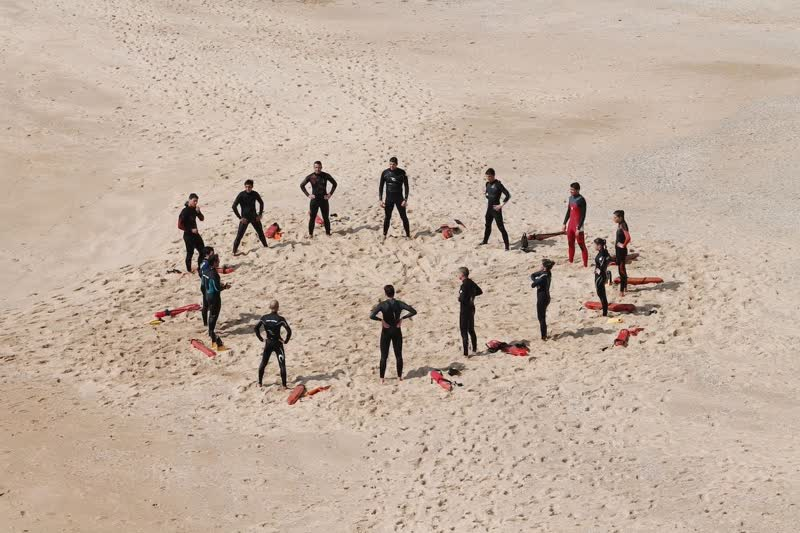
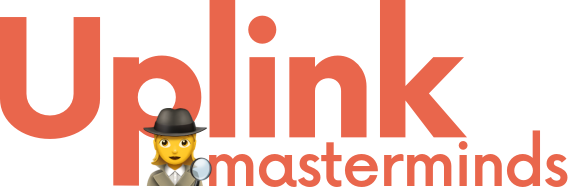

A few weeks ago we started experimenting with a mentoring format at Uplink which is very popular in the United States: Mastermind groups.

From [Wikipedia](https://en.wikipedia.org/wiki/Mastermind_group):

> A **mastermind group** is a [peer-to-peer](https://en.wikipedia.org/wiki/Peer-to-peer) [mentoring](https://en.wikipedia.org/wiki/Mentorship) concept used to help members solve their problems with input and advice from the other group members.

Sounds simple? Technically yes. The tricky part is to find a group of like-minded individuals who can relate to each others' situations in order to give advice or to ask the right questions. Thankfully, at Uplink we have a large pool of like-minded individuals who can relate to being a freelancer in the IT world. For the kind of mastermind we introduced at Uplink, a group between 4 and 8 people with a similar mission is ideal.

<!--truncate-->

### Meetings

The groups meet in a fixed interval, in our case every four weeks, for 90 minutes maximum. In order to stay focused it's important to keep the meetings short and on-topic. In each meeting, one person from the group takes on the moderator role—they make sure everybody stays within their allotted time to speak, take notes, and schedule the next meeting. Everyone is welcome to bring some snacks and drinks. It has shown that meetings are most effective when the role of the moderator rotates for each meeting.

### The Hot Seat

Depending on the group size, every individual gets 15-25 minutes of "Hot Seat" time, which they may use to share their situation and the challenges that they are seeking advice for. During Hot Seat time, the others ("advisers") pay attention to the subject and may ask questions and give advice on the subject's challenges. It's important to stay focused and avoid veering off into topics which are irrelevant to the subject's situation. Especially the moderator should pay attention to this and kindly remind the group to stay focused in case a discussion goes off-topic. Think of it this way: The advisers are gifting their time, attention, and advice to the subject—and that's what the mastermind is about!

### Action Steps

The last three minutes of each Hot Seat are dedicated to the subject to formulate and write down 2-3 Action Steps, which they commit to do until the next meeting. Those should fulfill the [SMART criteria](https://en.wikipedia.org/wiki/SMART_criteria) (specific, measurable, actionable, realistic, time-bound) and somehow reflect whatever was discussed during the Hot Seat. The advisers may also note these steps and ask the subject about their status on the next meeting. For people who have trouble sticking to their commitments, it is possible to partner up and hold each other accountable to the Action Steps by pinging each other about their progress in the time between meetings.

### Confidentiality & Trust

A Mastermind Group is meant to support each other in all kinds of situations: business, relationships, emotions, self improvement, health, fulfilling one's dreams, and even creative matters. In order for the Mastermind Group to be really effective it is necessary that the group members are not in a specific relationship to each other, like that of an employer/employee, customer/client, or colleagues at the same company/client. These could potentially be barriers to being really honest about one's thoughts, challenges, and ideas. It's also advantageous if the group agrees to keep strict confidentiality about everything discussed in the Mastermind Group.

### Let's get started!

At Uplink, two Mastermind Groups evolved from a call-out in our Slack channel: those who are interested in leveling up their game as a freelancer and those who are looking to get away from selling their time and rather want to start a business or service. For each group, we set up a closed Slack channel with all participants to share resources, report on progress on their Action Steps, and organize the meetings. So far the feedback has been great and we're motivated to start more Mastermind Groups within the Uplink community!

So if you're interested to join a Mastermind Group or start one of your own, whether it's for one of the mentioned topics or something completely different, get in touch! We're happy to help you get started with finding like-minded people, book a room, and help with the first few meetings!
