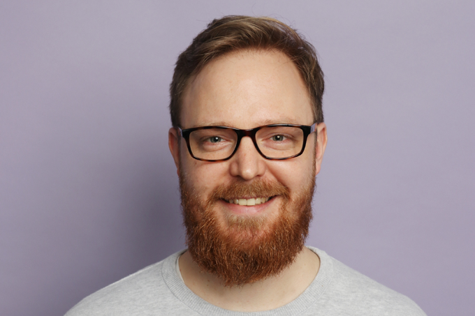

_Die Uplink-Community wächst und wächst. Zeit, euch unsere Mitglieder einmal persönlich vorzustellen. In unserer neuen Interview-Reihe gehen wir darum ab sofort mit jeweils einem unserer Mitglieder ins Gespräch. Wir hören nach, was sie zum Freelancer-Dasein bewogen haben, welche Hürden sie überwunden haben und was abseits der Auftragsjobs sonst noch so los ist._

**Heute: Rust-Experte Bastian Gruber**

<!--truncate-->

**Bastian, was hat dich dazu bewegt, dich selbstständig zu machen?**

Ich sehe mich nicht unbedingt als Teil einer Firma, sondern als Experten in verschiedenen Feldern. Diese Expertise will ich in verschiedenen Projekten einfließen lassen und von und mit anderen lernen. Ich habe die Erfahrung gemacht, dass das in einer freiberuflichen Umgebung besser zur Geltung kommt. Was mich an dem Berufsfeld fasziniert, ist, dass es quasi kein Beruf ist, sondern Lebensrealität. Es vergeht keine Sekunde, in der man nicht von Daten und Signalen umgeben ist. Das zu verstehen, zu beeinflussen und mitzuwirken, hat mich verleitet, Programmierer zu werden. Diese Faszination will ich ausleben und mich nicht strikt an eine Firma binden, um Umsatz zu generieren, sondern ich will diese Faszination weitergeben, vermitteln und täglich leben.

**Mit welchen Kunden und Technologien arbeitest du am liebsten?**

Die Branche oder Größe ist mir relativ egal, da es immer spannend ist, andere Umgebungen und Herausforderungen kennen zu lernen. Was der Kunde jedoch mitbringen muss, ist die Herausforderungen, vor denen er steht, zu verinnerlichen und zu wissen, was diese mit sich bringen. Derzeit spezialisiere ich mich auf Rust, einer neuen Programmiersprache von Mozilla. In der Vergangenheit habe ich aber auch mit Node.js und Go gearbeitet.

**Was sind für dich persönlich die Vorteile des Freelancens? Wo siehst du Schwierigkeiten?**

Die Vorteile liegen ganz klar in der Mentalität. Ich sehe mich als Experten, der sich einbringen will und mindestens eine Sache verbessert hat, nachdem er weg ist. Als Freelancer ist man sehr frei in der Wahl der Technologie und wie man sich weiterbildet. Man lernt zum Beispiel eine neue Sprache oder Technologie und kann dies anschließend direkt in einem Kundenprojekt einbringen.

Die Schwierigkeit ist ganz klar im ständigen Wechsel der Arbeitgeber. Neue Teams, neuer Code, neue Projekte. Man hat wenig Zeit, sich einzuarbeiten und muss von Tag 1 an da sein. Auch muss man sich selbst um seine Fähigkeiten kümmern und sich seinen eigenen Karriereplan entwerfen.

**Nenne uns eine Sache, die man als erfolgreiche/r Freelancer/in unbedingt tun sollte!**

Man sollte nicht in ein Projekt gehen und schlecht über den bestehenden Code, Prozesse oder Teams reden. Man ist hier, um zu helfen. Sobald man sich beschwert, impliziert es, dass man sich nicht helfen kann. Die Teams oder Programmierer vor einem waren nicht schlechter oder unfähig, sondern mussten auch irgendwie mit einer Umgebung klarkommen. Unvoreingenommene Hilfe anbieten und diese umzusetzen ist das A und O für eine gesunde Karriere als Freelancer.

**Und eine Sache, die man auf gar keinen Fall tun sollte?**

Sich zu überschätzen und zu denken, dass der Code, den man schreibt, das ganze Projekt verbessert. Das Team ist wichtig, das Endresultat, nicht unbedingt, ob man 10 Zeilen Code spart. Man darf sich nicht einzig als Coder sehen, sondern muss immer Teams, die Menschen und die Ziele miteinander in Einklang bringen.

Ganz wichtig zu wissen in der aktuellen Marktlage: Viele wollen die Programmiererknappheit nutzen, um ein höheres Einkommen für sich zu erzielen und wechseln daher in die Freiberuflichkeit. Das kann ganz schön nach hinten losgehen, denn Geld ist immer nur die Konsequenz einer Mentalität und Einstellung. Geld allein darf nie Ziel und Grund für etwas sein.

**Was war/ist dein schönstes Kundenprojekt? Was hat dabei besonders gut geklappt?**

Das schönste Projekt war bislang für einen Kunden aus der Versicherungsbranche. Viel grüne Wiese und Kollegen, die genau das oben beschriebene verinnerlicht hatten. Das Endresultat zählte, und basierend auf dem Ziel haben wir alle super zusammen gearbeitet, ohne wirklich einem Prozess wie Scrum zu folgen. Ein Team aus Professionellen, die sich selbst nicht zu ernst genommen haben, aber super Programmierer und Menschen waren. Ein Traum.

**Woran arbeitest du gerade neben deinen Auftragsjobs?**

Ich beschäftige mich viel mit Finanzen und Kommunikation. Finanzen zum einen, da sich dort viel verändern wird in den kommenden Jahren, und Kommunikation zum anderen, da ich in ein paar Open-Source-Projekten involviert bin und mein neuer Auftrag 100% remote ist. Verständigung ist deshalb enorm wichtig, da ich keinen meiner Kollegen persönlich sehe.

**Wie schafft man es, aus einer Gruppe von Menschen ein Team zu machen? Hast du Ideen?**

Das wichtigste ist, das gemeinsame Ziel zu definieren. Viele Teams sind so im Alltag verstrickt, dass sie “zum Problem hin” arbeiten, anstatt “vom Problem zurück”. Man sollte also zuerst festlegen, wie die Lösung aussehen kann, darf und soll, und dann die notwendigen Tools und Prozesse schaffen, um dorthin zu kommen. Dadurch kann man auch viele Graben- und Ego-Kämpfe vermeiden.

**Was sind die Hürden, die man deiner Erfahrung nach bei der Arbeit in Teams häufig überwinden muss?**

Viele Teams sind über Jahre hinweg gewachsen und Hierarchien haben sich festgesetzt. Auch ist es manchmal so, dass Team-Leads nicht gerade für eine gute Stimmung sorgen, sondern die eigene Position wahren wollen. Eine offene Atmosphäre zu schaffen, in der jeder zu Wort kommt, ist manchmal sehr schwierig. Auch, dass Kritik und Vorschläge nicht persönlich genommen werden, ist eine große Hürde.

**Wie sieht für dich die ideale Teamkonstellation aus?**

Hierarchien und verschiedene Erfahrungsstufen sind gut und wichtig, allerdings heißt das nicht, dass nur die erfahrenen Leute sprechen. Eine gute Teamkonstellation hat verschiedene Typen und Erfahrungsstufen gemischt. Alle kommunizieren offen und ohne Vorbehalte. Entscheidungen werden dann nach Erfahrungen gewichtet getroffen und alle Standpunkte werden, so gut es geht, beachtet. Ein Junior-Entwickler kann also genauso eine Idee durchbringen wie ein Senior. Ideen werden im besten Falle aufgewertet und vom Senior angereichert.

**Wie profitiert der Einzelne aus der Arbeit in funktionierenden Teams?**

Ich sage das immer wieder: In der heutigen Zeit geht man nicht mit einer Firma in Rente. Ein Entwickler bleibt im Schnitt 3-5 Jahre einer Firma treu. Das meiste kann man also aus guten Entscheidungen und Erfahrungen mitnehmen. Jeder im Team lernt von einer gut umgesetzten Entscheidung. Ein Beispiel: Paula hat relativ wenig Ahnung in Sachen “Skalierbare Produktionsumgebung”. Ihr Ziel ist es also, nicht einfach einen Job zu machen, sondern so viel Erfahrung wie möglich zu diesem Thema zu sammeln, um bei der nächsten Firma dadurch eine tragende Rolle zu spielen. Setzt ein Team also ein Projekt sehr erfolgreich um, profitiert nicht nur die Firma, sondern auch der Einzelne, da er oder sie diese Erfahrung dann in der Zukunft wieder einsetzen kann.

_Du möchtest auch in unser Interview-Reihe erscheinen? Dann melde dich bei uns unter [hello@uplink.tech](mailto:hello@uplink.tech) :)_
