On August 30, we invited our Munich-based members out for a beer for the second time! This time the location was the [Container Collective in Werksviertel](https://www.werksviertel-mitte.de/construction/container-collective/), a pretty cool "pop-up city" built with containers and all kinds of shops, bars and creative spaces.

Thanks to [Jeff](https://www.linkedin.com/in/jewgenij-steinhart-57419932/) and [Stefan](https://mad-scientists.com) for hosting this meetup!

<!--truncate-->

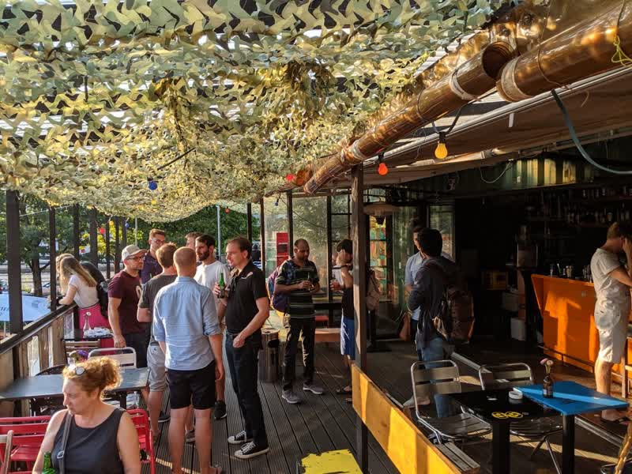

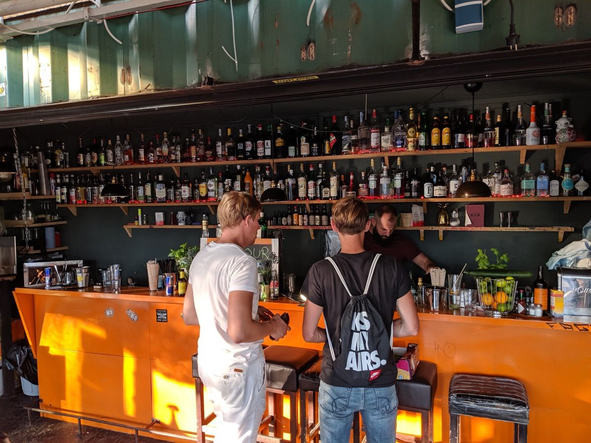

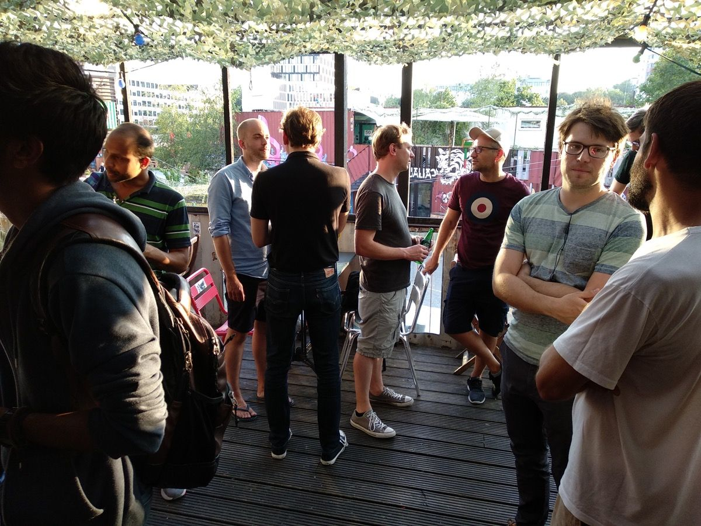

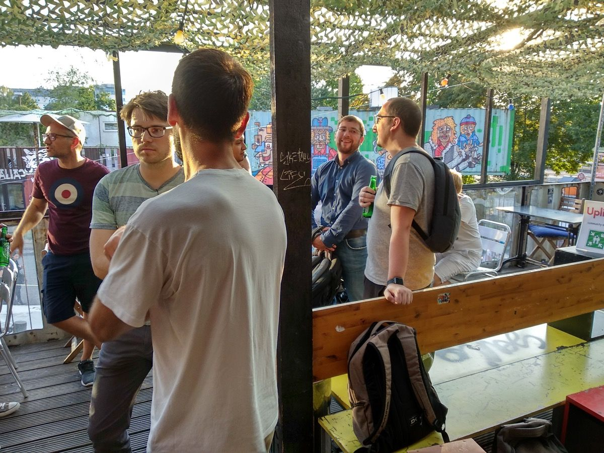

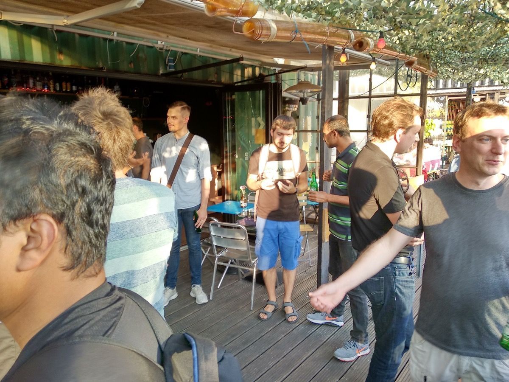

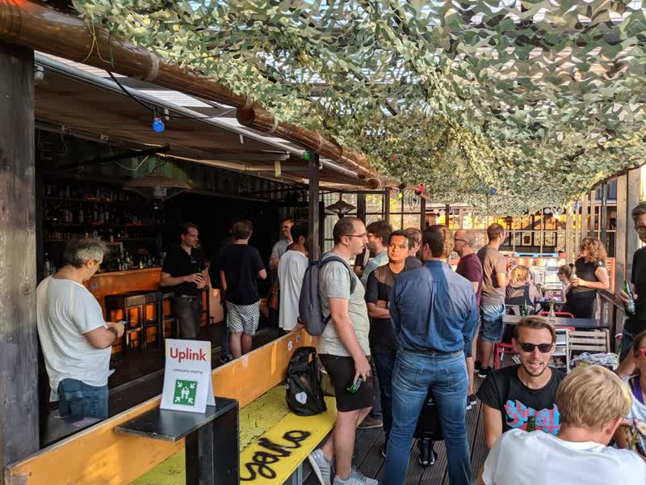

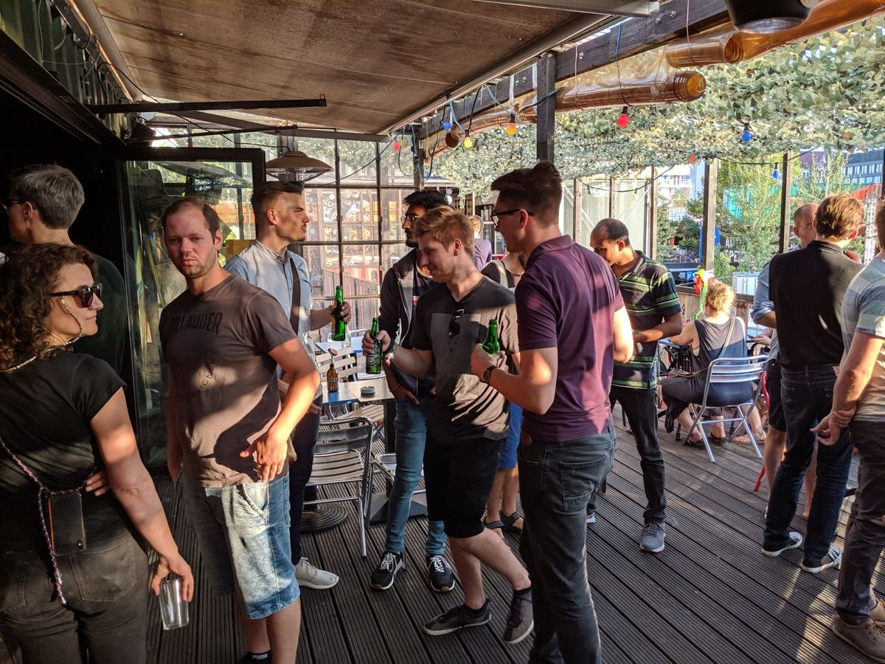

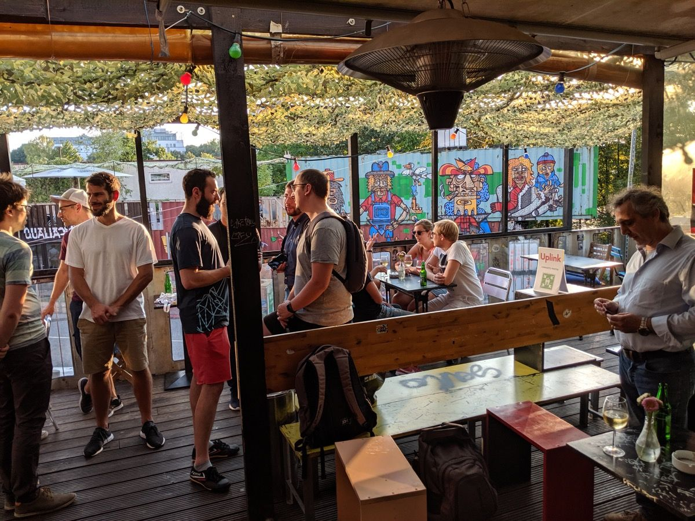

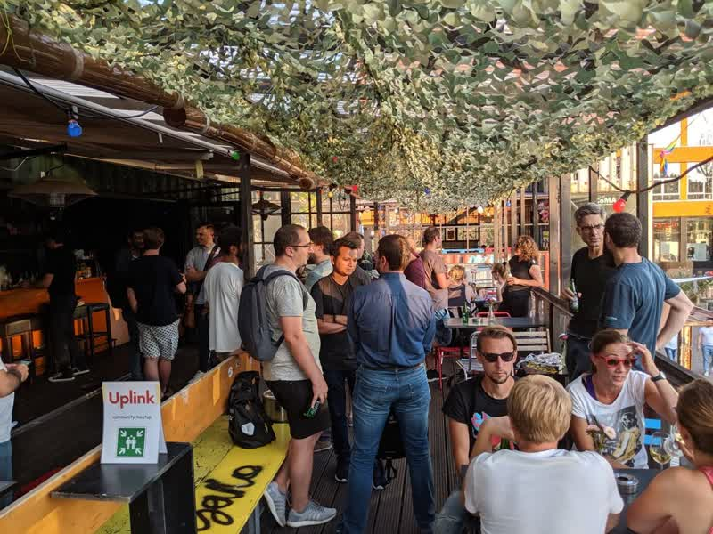

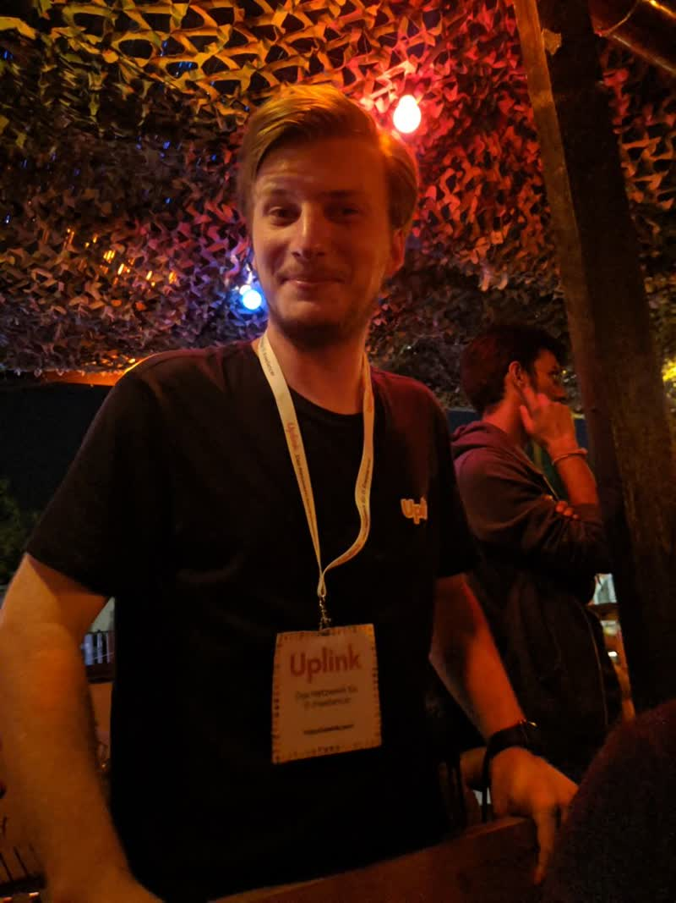

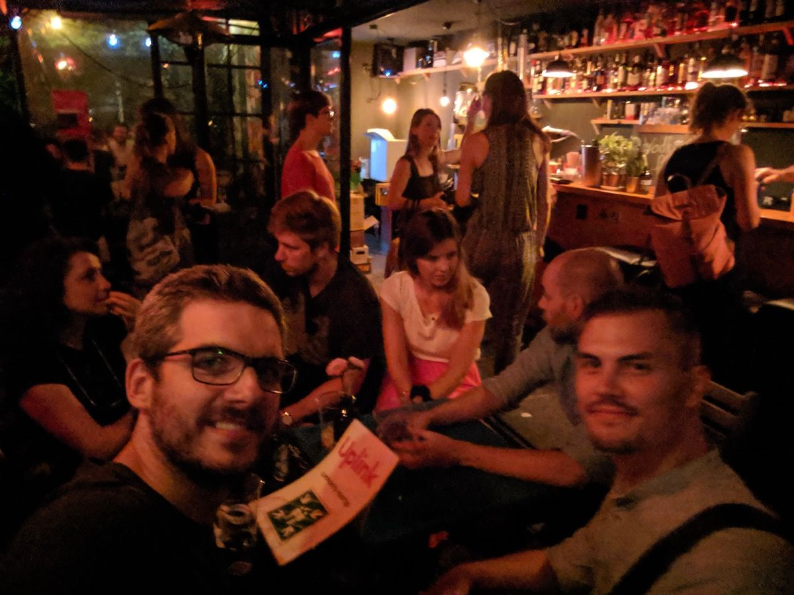

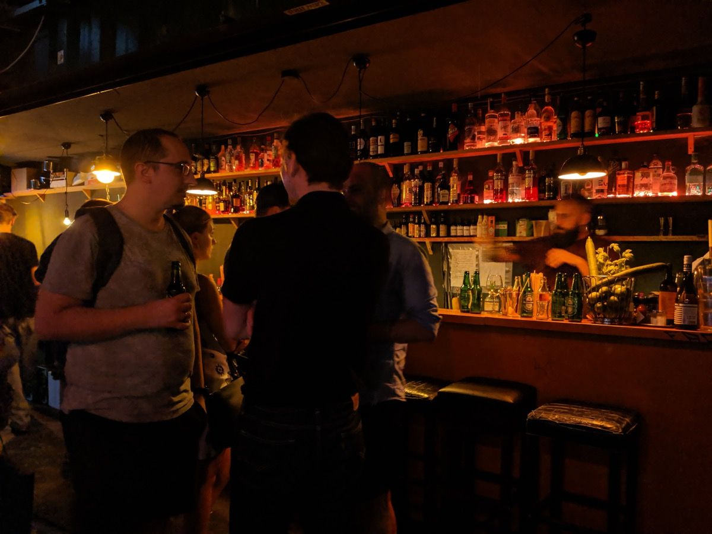

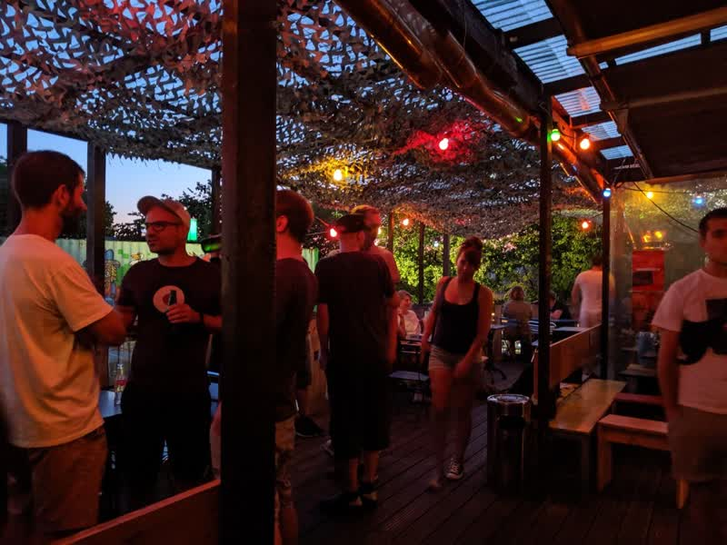

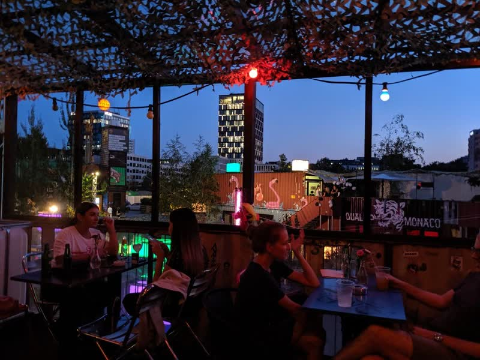

If you'd like to meet other IT freelancers in Munich for a beer, [join us!](https://uplink.tech/freelancer/#apply)
