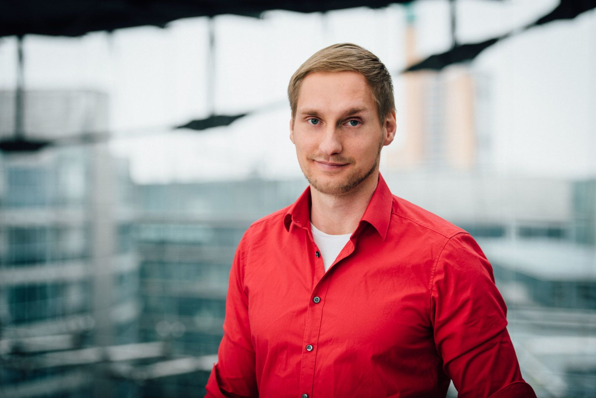

_Die Uplink-Community wächst und wächst. Zeit, euch unsere Mitglieder einmal persönlich vorzustellen. In unserer Interview-Reihe "_Meet the Uplink Community" _gehen wir darum mit einem unserer Mitglieder ins Gespräch und hören nach, was sie oder ihn zum Freelancer-Sein bewogen hat, welche Hürden im Freiberufler-Dasein zu überwinden sind und was abseits der Auftragsjobs sonst noch so los ist._

Diese Woche: **Android-Experte Thomas Krüger**

<!--truncate-->

**Thomas, was hat dich dazu bewegt, dich selbstständig zu machen?**

Nach vielen Jahren als Angestellter merkte ich immer wieder wie “aufregend” ein neuer Job ist: Man lernt neue Leute kennen, neue Technologien und zu guter letzt hat jede Firma und jedes Office seine ganz eigene Atmosphäre. Die Abwechslung und der Gedanke, all das regelmäßig aufs Neue zu erleben, waren da durchaus der Hauptgrund. Natürlich geht man damit jedes mal ein Stückchen aus seiner Komfortzone, aber bekanntlich wächst man ja dort am besten ;) Neben der Abwechslung war die Freiheit, selbstbestimmter zu arbeiten ebenfalls ein wichtiger Faktor: Vom “Digital Nomad Life” bis hin zum Remote-Jobs auf Thailand abarbeiten, gibt es dort kaum Grenzen. Der letzte und mitunter wichtigste Punkt ist zudem, dass die Selbstständigkeit einfach viele Möglichkeiten bereithält: verschiedene Branchen, Schwerpunkte, Firmenkulturen und Vergütungsmodelle. Alles in allem sehr abwechslungsreich mit viel Potenzial zum Lernen und Wachsen.

**Mit welchen Kunden und Technologien arbeitest du am liebsten?**

Nach vielen verschiedenen Kunden und Projekten habe ich da durchaus eine Präferenz entwickelt: weg von kleinen Startups (die oft recht unorganisiert und sprunghaft sind) oder Mittelständlern, hin zu vergleichsweise “langweiligen” Corporates und ggf. deren Startups. Zwar mag ein klassisches Startup seinen ganz eigenen Charme haben, mir persönlich liegt da aber eher das Corporate-Umfeld mit Hierarchien und Prozessen. Die Reichweite und der Impact bei solchen Projekten wird oft mit den entsprechenden Mitteln gefördert, was mir Planungssicherheit und ein fertiges Produkt eher garantiert.

Seitens Technologien setze ich als Android-Experte konsequent auf den aktuellsten Best Practice, der von Google vorgeschlagen wurde: Kotlin, Android Jetpack, AndroidX, KTX und alles in einer MVVM Architektur inklusive DataBinding. Im Backendbereich dann bestenfalls Spring Boot mit Kotlin und eine saubere Rest-API, dokumentiert mit Swagger (oder Postman).

Zwar gibt es natürlich auch immer wieder Legacy-Projekte mit alten Android-Praktiken und Standards, mit etwas Erfahrung kriegt man die aber recht gut “modern refactored” und schnell auf aktuelle Standards, bei gleichzeitiger Reduzierung der TechDepth.

**Was sind für dich persönlich die Vorteile des Freelancens? Wo siehst du Schwierigkeiten?**

Wie bereits schon eingangs erwähnt, ist die regelmäßige Abwechslung und die vielen Möglichkeiten einer der großen Vorteile. Als Freelancer lernt man aus verschiedenen Teams und “kommt viel rum”. Nebenher kann man sich einen Kundenstamm und Reputation aufbauen, um nachhaltig ein Business zu schaffen. Mit der richtigen Spezialisierung und dem richtigen Netzwerk ist Freelancing zudem finanziell durchaus lukrativ - Disziplin zum Faktura vorausgesetzt!

Genau an dem Punkt kommen aber auch die Nachteile ins Spiel: Fehlende Disziplin kann da verheerend sein! Ebenfalls sind Kranktage, Urlaub, Weiterbildung, Akquise, Steuern und Networking nicht zu vernachlässigen. Ein Mentor kann bei solchen Themen Gold wert sein!

**Nenne uns eine Sache, die man als erfolgreiche/r Freelancer/in unbedingt tun sollte!**

Zu Beginn ist die Spezialisierung wichtig: Externe Freelancer werden als Experten angeheuert, weniger als Generalisten. Seine Fähigkeiten (kritisch!) zu hinterfragen und seinen Marktwert zu bestimmen, ist der erste Schritt, um herauszufinden wie lukrativ es letztlich wirklich ist.

Seine Akquise und Steuern in Prozessen zu automatisieren spart zudem viel Zeit und Nerven. Der Austausch mit anderen Experten und Freelancern ist zudem sehr förderlich, um ein Gefühl für den Markt zu bekommen – schließlich ist man nicht allein und muss das Rad nicht neu erfinden.

**Und eine Sache, die man auf gar keinen Fall tun sollte?**

Viele Freelancer bekommen oft beim Thema Akquise oder kurz vor Projektende “kalte Füße” und handeln dadurch undurchdacht. Oft verkaufen sich viele unter Wert – aus der Ungeduld und Unsicherheit heraus – und gehen schlechte Konditionen ein, was schnell zu Frust führt. Gerade bei der Akquise verlassen sich viele blind auf Recruiter, ohne eine Vergleichbarkeit zu schaffen und beschweren sich dann im Nachhinein.

Das Ganze lässt sich recht einfach umgehen, wenn man sich selbst Prinzipien auferlegt und Integrität bewahrt. Auch Angst vor Akquise, Arbeitslosigkeit, dem Finanzamt oder anderen Dingen sind oft unbegründet, was man aber erst mit steigender Erfahrung als Freelancer lernt. Genau aus dem Grund lohnt es sich, von anderen Freelancern zu lernen und sich mit ihnen auszutauschen oder gar einen Mentor zu haben – um nicht alle trivialen möglichen Fehler zu machen.

**Was war/ist dein schönstes Kundenprojekt? Was hat dabei besonders gut geklappt?**

Das bisher beste Projekt ist sogar mein aktuelles: Bei BahnX - “Wifi@DB” hat die Deutsche Bahn ein Setup und Team auf die Beine gestellt, das sich sehen lassen kann! Dort wurde konsequent beim Personal und Prozessen auf “Qualität statt Quantität” gesetzt – und das merkt man! Das Setup gibt ordentliche, schlanke und vor allem einfache Prozesse her: eine super CI/CD Pipeline, Testen direkt am User und (vergleichsweise) wenige Meetings – alles ohne großen Overhead. Die Kultur spiegelt eine “Macher-Mentalität” wieder, in der Ownership ganz oben steht und unnötige Meetings nicht vorhanden sind. So macht Softwareentwicklung Spaß!

**Woran arbeitest du gerade neben deinen Auftragsjobs?**

Bis vor ein paar Monaten war ich nebenher bei Coachyoo.com als CTO tätig: das PokemonGo-Prinzip im Fitnessbereich. Für mich eine interessante Erfahrung, ein Startup von Anfang an zu begleiten und jenseits von Android entsprechende Entwicklungen zu steuern.

Aktuell bin ich nun bei Watchbooks.de als CTO unterwegs: “Bücher endlich streamen” oder “Das Netflix für Bücher” erklären recht einfach, worum es sich dabei handelt. Da ich selbst gerne mehr Bücher lesen wollen würde, aber selten die Zeit finde, kann ich mich super mit dem Produkt identifizieren und nutze es selbst regelmäßig.

Jenseits davon bin ich aktuell dabei, meine Firma Red Android weiter auszubauen: Um meinen Kunden weiterhin gute Softwareentwicklung zu bieten, suche ich derzeit Entwickler, um das Freelancing zu einer Software-Beratung auszubauen. Da gute Entwickler natürlich rar und trotz gutem Netzwerk schwer zu finden sind, ist das natürlich eine langfristige Aufgabe – die auch durchaus Spaß machen kann.

_Du möchtest auch in unser Interview-Reihe erscheinen? Dann melde dich bei uns unter [hello@uplink.tech](mailto:hello@uplink.tech) :)_
