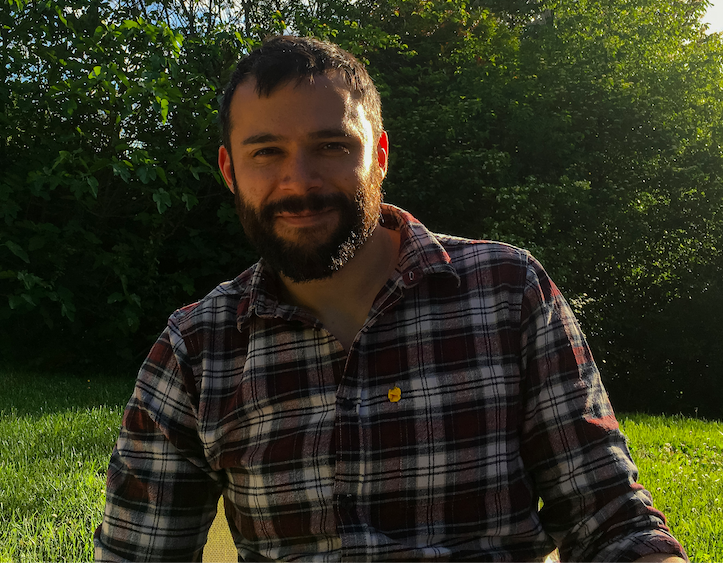

_Die Uplink-Community wächst und wächst. Zeit, euch unsere Mitglieder einmal persönlich vorzustellen. In unserer Interview-Reihe "_Meet the Uplink Community" _gehen wir darum mit einem unserer Mitglieder ins Gespräch und hören nach, was sie oder ihn zum Freelancer-Sein bewogen hat, welche Hürden im Freiberufler-Dasein zu überwinden sind und was abseits der Auftragsjobs sonst noch so los ist._

Diese Woche: **React-Native-Entwickler Niels Madan**

**Niels, was hat dich dazu bewegt, dich selbstständig zu machen?**

Ich habe bei einer großen Software-Firma ein paar Jahre als Teamleiter gearbeitet und war dabei die Karriereleiter weiter hoch zu klettern. Nach ein paar Jahren, wäre ich wahrscheinlich im Middle Management angekommen, aber so wirklich sicher, dass ich dahin wollte, war ich mir nicht. Also dachte ich mir, ich versuche nochmal etwas anderes bevor ich in diese Richtung gehe.

Somit habe ich dann meinen Job verlassen und habe erstmal an einer meiner eigenen Ideen gearbeitet. Das war eine App zur Planung für Besucher von Messen und Konferenzen. Diese habe ich nach ein paar Monaten Entwicklung auch veröffentlicht. Sie ist bei Nutzern dann auch sehr gut angekommen, aber hat leider am Ende nicht so wirklich viel Geld eingebracht, weshalb ich mit dem Freelancen angefangen habe.

**Mit welchen Kunden und Technologien arbeitest du am liebsten?**

Ich arbeite am liebsten an Projekten, bei denen man schnell Fortschritt sehen kann. Also gerne bei Start Ups oder auch an neuen oder kleineren Projekten bei größeren Firmen. Und wenn man dann noch nah am Nutzer ist und sehen kann, wie die die Features, die man baut, ankommen, ist es noch besser.

Außerdem bin ich auch noch ein Fan von Refactoring. Also wenn’s bei einem Projekt im Code drunter und drüber geht, finde ich, dass es eine interessante Herausforderung ist, eine saubere Struktur zu definieren und dann auch den Weg dahin zu finden.

Zu den Technologien: Früher C++ und Python, in den letzten Jahren hauptsächlich Javascript / React Native. Aber auch etwas Web React und Backend mit Express und Apollo. Die Technologien, die ich gerade benutzen, gefallen mir auch ziemlich gut, aber ich bin auch wieder mal offen für was neues.

**Was sind für dich persönlich die Vorteile des Freelancens? Wo siehst du Schwierigkeiten?**

Der größte Vorteil ist für mich die Flexibilität. Ich kann einfach zwischen zwei Projekten ein bis zwei Monate “Urlaub” machen und auch manchmal remote arbeiten. Insbesondere, da meine Frau als Entwicklungshelferin / Friedensstifterin öfter länger im Ausland ist, ist das sehr praktisch.

Was ich sonst noch gut finde, ist, dass man sehr schnell sehr viel Erfahrung sammeln kann. Bei jedem Projekt gibt es ein paar neue Technologien, neue Leute und neue Situationen. Im Vergleich zum Angestelltendasein, wo sich oft länger nicht viel verändert.

Schwierigkeiten hatte ich eigentlich bis jetzt nicht wirklich.

**Nenne uns eine Sache, die man als erfolgreiche/r Freelancer/in unbedingt tun sollte!**

Das richtige Projekt aussuchen. Das kommt natürlich etwas darauf an, in welchem Bereich man arbeitet und wie der Markt aussieht, ob man da den Luxus hat, sich etwas aussuchen zu können. Aber wenn man kein gutes Gefühl nach einem Interview hat und nicht darauf angewiesen ist, unbedingt sofort ein Projekt anzufangen: lieber absagen und ein bis zwei Wochen auf das nächste Angebot warten. Am besten beim Interview auch schauen, dass man mit Teammitgliedern redet und nicht nur mit dem Management.

Außerdem sollte man möglichst direkt und explizit bei der Kommunikation mit dem Kunden sein. Besser einmal mehr nachfragen bzw. Dinge wiederholen, als dass es am Ende Überraschungen gibt. Jeder Kunde ist anders und was bei einem Kunden selbstverständlich ist oder kaum der Rede wert, muss man bei einem anderen Kunden explizit klarstellen.

**Und eine Sache, die man auf gar keinen Fall tun sollte?**

Abwarten. Als Angestellter kann man sich ja gerne mal ein bis zwei Monate einarbeiten und orientieren, bevor man selbst Initiative ergreift. Bei einem Freelance Projekt ist man nach ein bis zwei Monaten vielleicht schon wieder weg. Also insbesondere, wenn man noch andere Erfahrungen/Fähigkeiten neben dem Codeschreiben hat, sollte man schauen, dass man die auch flott an den Kunden bringt. Es gibt natürlich auch Kunden, die einfach nur jemanden haben wollen, der Code schreibt, aber die meisten sind glücklich, wenn man auch bei der Architektur, dem Softwareentwicklungsprozess oder dem Release Management etwas verbessern kann. Und weil man als Freelancer ja schon so viele verschiedene Sachen gesehen hat, hatte man ja vielleicht gerade auch schon mal ein ähnliches Problem wie der jetzige Kunde gerade und weiß einen guten Lösungsansatz.

**Was war/ist dein schönstes Kundenprojekt? Was hat dabei besonders gut geklappt?**

Ich hatte ein Projekt bei einem Start Up, das richtig Spaß gemacht hat. Ein kleines Team, jeder war kompetent, voll dabei und motiviert. Die Freelancer waren voll ins Team integriert und es gab kaum Bürokratie. Und nah am Kunden war es auch. Da hat man echt jeden Tag Fortschritt gesehen.

**Woran arbeitest du gerade neben deinen Auftragsjobs?**

Ich arbeite weiter an meiner Messe-/Konferenz-App. Die Nutzer sind weiterhin begeistert und irgendwann finde ich vielleicht auch den passenden Kunden und/oder Investoren.

Und dann hab ich noch das Nebenprojekt zum Nebenprojekt: ein Spiel namens Mathfiend auf iOS.

_Du möchtest auch in unser Interview-Reihe erscheinen? Dann melde dich bei uns unter [hello@uplink.tech](mailto:hello@uplink.tech) :)_
