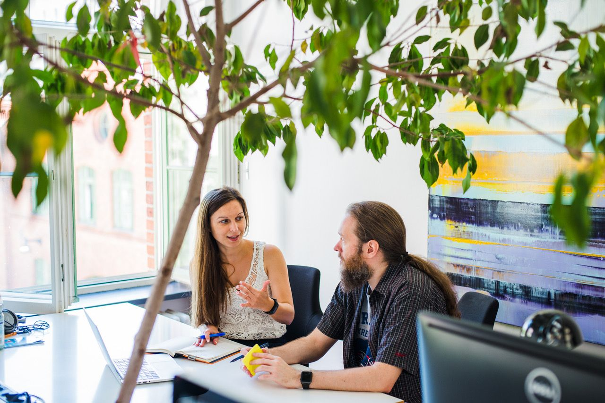
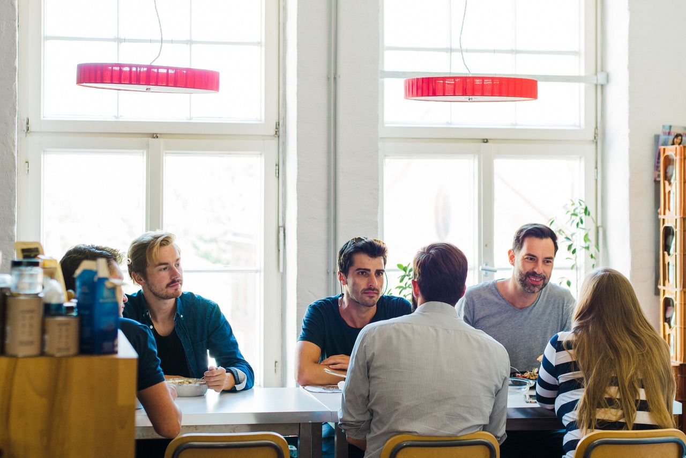
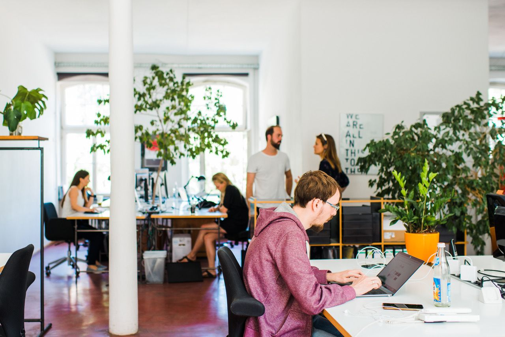
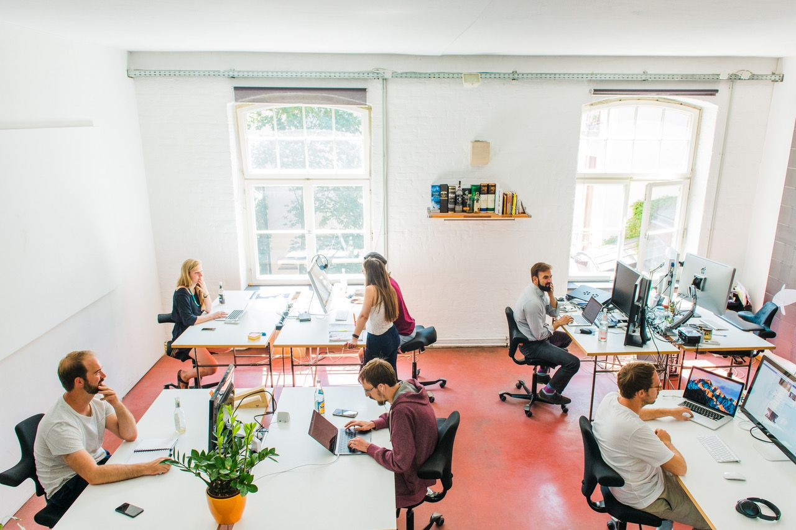
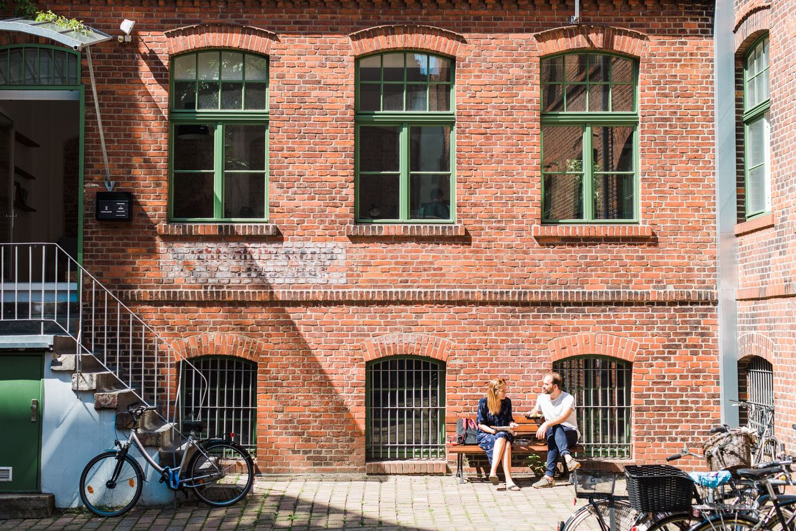
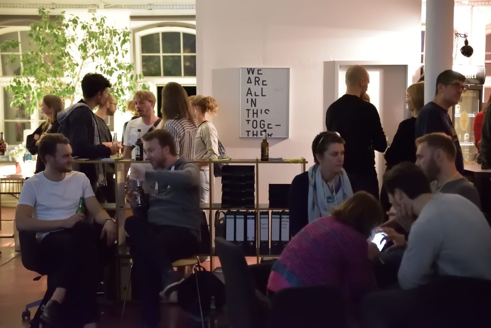

_Update July 2020 - the Welance coworking space does not exist anymore unfortunately!_

In times where working remotely is becoming more and more normal among freelancers as well as [regular employees](https://de.statista.com/statistik/daten/studie/964479/umfrage/umfrage-zur-nutzung-von-homeoffice-in-deutschen-unternehmen/), the challenge for everyone who cannot (or does not want to) work from home or a nearby café is to find a suitable coworking space. Recommendations for good coworking spaces are requested regularly in our community, so we decided to try to find a space that we can recommend to our members in Berlin.

We're happy to report that we found one in [Welance](https://welance.de/)!

Welance originated as a freelancer collective and is still mostly composed of freelancers who work on their own projects or occasionally team up to work on a larger client project together. It has a more personal touch compared to larger coworking spaces like Betahaus or The Factory, yet the atmosphere is quite professional and the interior is of high quality. Welance is located in a beautiful building in a backyard in Berlin-Kreuzberg, just a short walk from Oranienplatz.

So if you're a member of Uplink and currently looking for a place to work with like-minded freelancers, Welance offers you three free trial days (limited to the first 10 people). Simply [contact them via email](mailto:hello@welance.de) to book your days.

Here are some impressions of the space:

