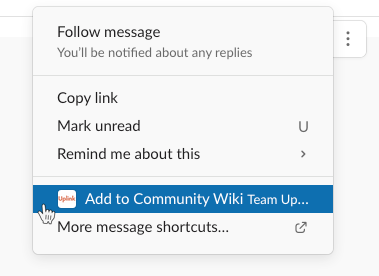
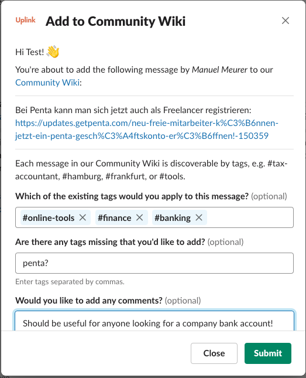

One of the features, that many members of our community have asked for over the years, was a way to "bookmark" certain posts from our Slack workspace to make it possible to find them again later.

**We are happy to announce that this functionality has finally arrived in the form of our Community Wiki!**

<!--truncate-->

The way it works is that every member can from now on use a Slack [message shortcut](https://slack.com/help/articles/360004063011-Work-with-apps-in-Slack-using-shortcuts#message-shortcuts) to suggest that a message be added to the Community Wiki:

Each message can then be categorized with tags:

Once a message has been suggested, someone from the Uplink admin team will check it out, add or remove some tags, and then ask the author of the message (unless it's the same member that suggested adding it) whether she's ok with her message appearing in the Community Wiki.

All confirmed wiki entries will then be accessible in the [Community Wiki section in our member backend](https://my.uplink.tech/community/wiki), filterable by tags and searchable.

**We're sure that the Community Wiki will fill up quickly with the wisdom of the Uplink crowd, and it will hopefully become a valuable resource for new and existing members on all topics related to IT freelancing in Germany!**

As always, we welcome your feedback! Get in touch via [Slack](https://slack.com/app_redirect?team=T1LBG4C5N&channel=U1LB9UVJQ) or [email](mailto:hello@uplink.tech) if you have suggestions on how to further improve the Community Wiki. New features that we plan to implement in the upcoming weeks are grouped tags, tag suggestions, and promoting existing wiki entries when a question is asked in Slack.

Stay tuned! 📻

---

_Would you like to check out the Community Wiki but are not yet a member of Uplink? [Join us now, it's free!](https://uplink.tech/en#request)_

---

_Header Image by [H. B.](https://pixabay.com/users/FotoEmotions-872019/?utm_source=link-attribution&utm_medium=referral&utm_campaign=image&utm_content=1618377) from [Pixabay](https://pixabay.com/?utm_source=link-attribution&utm_medium=referral&utm_campaign=image&utm_content=1618377)_
