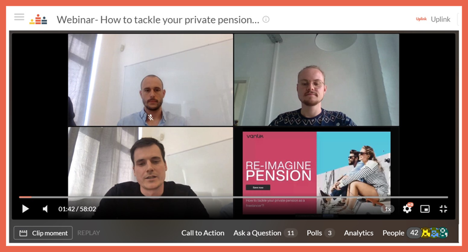

\*\*\*Update: our cooperation with Vantik has ended in February 2022\*\*\*

Recently, some of our members have expressed the wish to learn more about different savings and retirement options for freelancers. A survey during our webinar also revealed that most of the attendees associated the words "_confused_" and "_scared_" with thinking about their pension. Since we also think that the market of pension offerings in Germany is diverse but non-transparent, we wanted to give our members a better overview so that everyone can decide individually on a pension strategy.

**We are pleased that we were able to win Vantik as our partner for this project!** On June 10, we started our first webinar together, during which Florian and Matthias from Vantik presented an overview of how to tackle your private pension as a freelancer.

You can rewatch the whole webinar on our **[Crowdcast page](https://www.crowdcast.io/uplink)** and you can find the complete presentation in English [here](https://drive.google.com/file/d/1AY68xTkAHodCTf6mdP8rCdi83XBO_EeX/view).

One way of providing for your retirement is Vantik's own product, which offers a high degree of flexibility even in uncertain times such as a crisis or generally in times when you have no income or a lower income than usual.

**As an Uplink member you will receive a starting bonus of 50€ by signing up for Vantik's offer until the end of the year. Check out our [cooperations in the Uplink member area](https://my.uplink.tech/services/cooperations) for information on how to receive the bonus.**

If you have any further questions about our cooperation, please do not hesitate to contact [Florian](mailto:florian@vantik.com?subject=Vantik%20x%20Uplink%20), [Matthias](mailto:matthias@vantik.com?subject=Vantik%20x%20Uplink%20) or us directly. 🤙

---

_Would you like to hear about future webinars like the one with Vantik? Follow [our Crowdcast page](https://www.crowdcast.io/uplink) to stay in the loop!_
