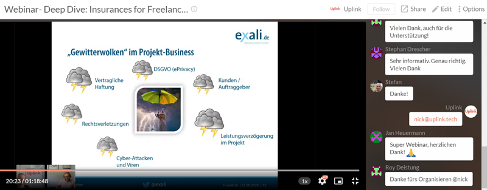

There is hardly a market that is as intransparent and saturated as the insurance market. If you google "insurance for freelancers", you'll get 1.040.000 results in 0.42 seconds. Here you can see how confusing and enormous the market for insurance services is. The times in which a few large insurance providers dominated the market are over - more and more founders are starting to change this traditional market and "InsurTech" startups such as [ottonova](https://www.ottonova.de/) and [Friendsurance](https://www.friendsurance.de/) are sprouting. One of these startups is our partner Exali, an insurance broker that offers custom-made insurance plans for freelancers.

<!--truncate-->

**We are pleased that we were able to run a webinar with Exali last week, and we secured a deal for our members that includes two free months (sign up before August 31!), on top of the 10% discount for the first year's fee that was already part of our cooperation.** Check out the [cooperations page](https://my.uplink.tech/services/cooperations) in the Uplink members area for further information.

In our joint event, Ralph, the founder of Exali, started off with an overview of the different use cases of an insurance coverage and explained in which cases an insurance can be useful for freelancers. He then talked about the necessities of insurance protection for freelancers, the types of financial loss and some insights about real practical examples. At the end, we had a stimulating discussion during which the participants got to ask Ralph more questions.

You can rewatch the whole webinar at any time by following this link: [https://www.crowdcast.io/e/uplinkexaliinsurances](https://www.crowdcast.io/e/uplinkexaliinsurances)

We are looking forward to continuing our cooperation in this spirit. If you have any further questions, please contact [Ralph and his team](https://www.exali.de/Ueber-exali/Unternehmen/Das-Team,100378.php) directly. 🤙
