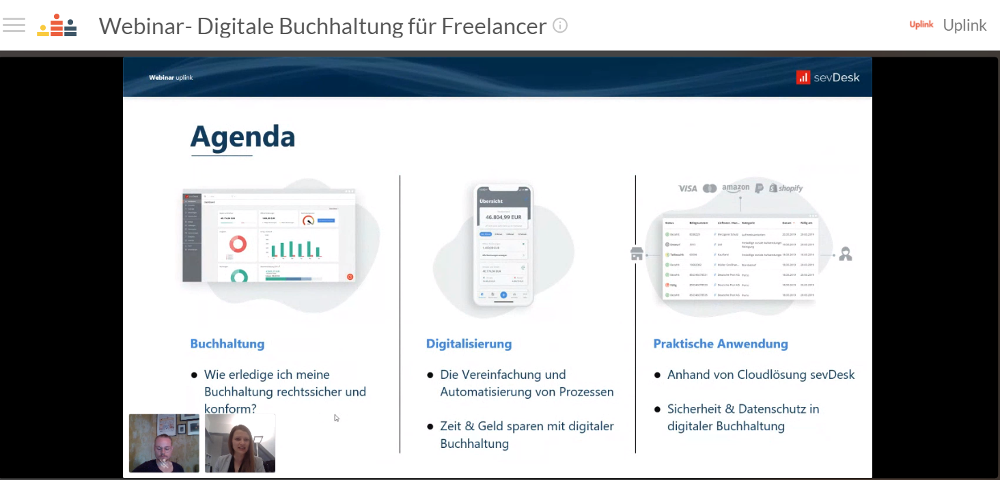

Recently we have noticed several discussions about accounting topics in our community.

The duties of a self-employed person include, besides the actual core project business, project acquisition as well as a variety of different administrative tasks such as accounting and taxes. For many freelancers, the accounting tasks are some of their least favorite ones. The simplest solution is, of course, to outsource the entire work to a tax consultant. However, if the tax consultant takes over all accounting tasks, you can expect relatively high costs. Thus a more pragmatic solution is to handle the preparatory accounting tasks yourself with the help of one of the various cloud-based accounting programs, and afterwards have it audited by a tax consultant.

In addition to our already existing cooperations with providers of financial and accounting software, we have decided to expand our spectrum, so that our community members can choose the appropriate partner for their needs.

**We are pleased that we were able to run a webinar with [sevDesk](https://www.awin1.com/awclick.php?gid=361518&mid=15944&awinaffid=733379&linkid=2370618&clickref=)(\*) last week, and we secured a deal for our members that includes a 30% discount for the first year's fee for all of sevDesk's offers.** Check out the [cooperations page](https://my.uplink.tech/services/cooperations) in the Uplink members area for further information.

In our joint event, Inna, the Head of CRM at sevDesk, started off with the goals of financial accounting in general and explained what you have to consider to be legally compliant (e.g., account assignment, financial statements, compliant invoices). In the end, numerous questions were asked about the product itself and the integration possibilities to other systems and applications.

You can rewatch the whole webinar at any time by following this link: [https://www.crowdcast.io/e/uplinksevdeskbuchhaltung](https://www.crowdcast.io/e/uplinksevdeskbuchhaltung)

We are looking forward to continuing our cooperation in this spirit. If you have any further questions, please [contact Inna and her team directly](https://www.awin1.com/awclick.php?gid=361518&mid=15944&awinaffid=733379&linkid=2370618&clickref=)(\*). 🤙

---

_(\*) The links marked with an asterisk are affiliate links. If you click on such a link and sign up to the service, we will receive a small referral commission._
