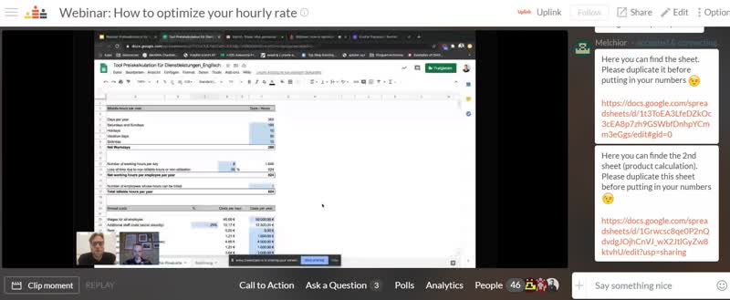

We are happy to reactivate our cooperation with the Berlin-based FinTech startup Kontist. We are still big fans of their business bank account designed for freelancers! Nowadays they're offering even more and help you to stay on top of your business with real-time tax calculation, accounting integrations, and much more.

<!--truncate-->

**This is why we're renewing our cooperation by offering Uplink members a nice deal: starting today, you can receive a 50€ starting balance when you open a new Kontist account. Check out our [cooperations in the Uplink member area](https://my.uplink.tech/services/cooperations) for information on how to receive the bonus!**

Last Tuesday, we had an exciting webinar with Melchior from Kontist titled "How to optimize you hourly rate" with more than 45 participants. Melchior himself has been working as a freelancer for many years and he is a qualified assistant tax consultant and knows a lot about calculation schemes. After some theoretical input, he talked about a helpful calculation sheet he developed, and there were plenty of opportunities to ask questions. According to the feedback and also to our impression this was a very successful beginning of a further cooperation. The Webinar was recorded and you can rewatch it at any time [on our Crowdcast site](https://www.crowdcast.io/e/webinaroptimizehourlyrate).

---

_Would you like to hear about future webinars like the one with Vantik? Follow [our Crowdcast page](https://www.crowdcast.io/uplink) to stay in the loop!_
