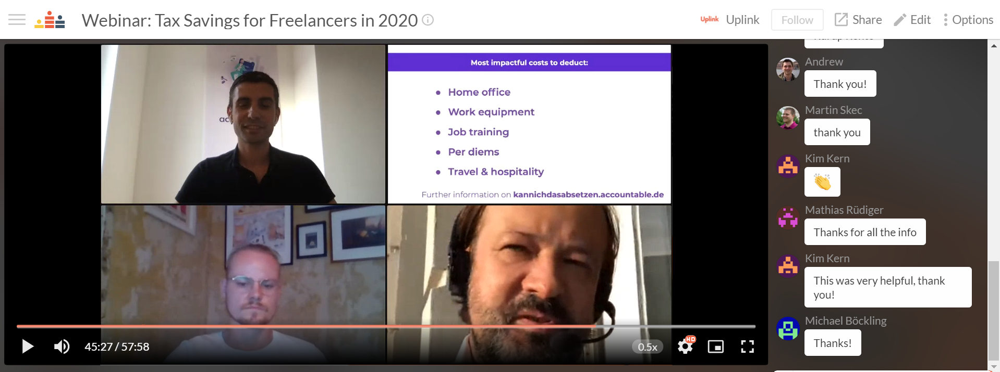

Time and again we have noticed in conversations with our freelancers that there is a high demand for an English-speaking accounting solution with which you can easily complete your tax return afterwards. Therefore, we have decided to get another partner in the area of accounting software on board, and [Accountable](https://www.accountable.de/) convinced us with their target group specific concept.

Accountable is a provider of accounting software that is specially tailored to the needs of freelancers in the fields of IT. Every three months, one of their partner accountants takes care of your accounting and gives valuable strategic tips for the upcoming months.

We are very happy that we were able to organize an exciting webinar together with Tino, the founder of Accountable, and Andreas, Accountable's tax consultant. Even when battling initial connection problems, the guys were not discouraged from giving valuable tips on how our freelancers can save taxes! In addition to that, numerous questions in the context of COVID-19 for the year 2020 were covered.

This time, the webinar was unfortunately not recorded, because many individual tax questions of our participants were answered. However, if you have any further questions, please feel free to contact Tino and his team directly.

Of course we also negotiated a great deal for you: Uplinklings can try out Accountable for free for 6 months! Check out the [cooperations section in the member area](https://my.uplink.tech/services/cooperations) for details.
