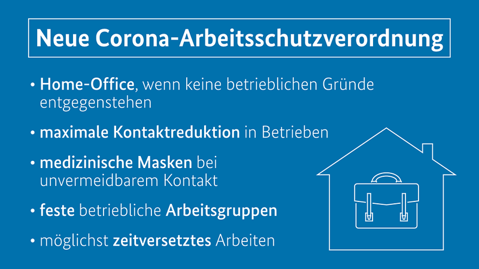

**Am 3. März hat die Bundeskanzlerin zusammen mit den Regierungschef*innen beschlossen, die Corona-Arbeitsschutzverordnung vom zuvor 15. März auf Ende April zu verlängern. Alles, was du über die Verordnung wissen musst, erfährst du in diesem Beitrag.**

<!--truncate-->

## Was gilt es zu beachten?

Die Corona-Arbeitsschutzverordnung dient dazu, die Ansteckungsgefahr von Arbeitnehmer*innen auf dem Weg zur Arbeit und während dieser zu minimieren.

**Bis Ende April gilt weiterhin, dass jede Arbeitgeber*in ihren Angestellten die Möglichkeit zum Homeoffice geben muss, soweit keine betrieblichen Gründe vorliegen, die dem entgegenstehen.**

Die gesetzlichen Bestimmungen werden hier äußerst streng ausgelegt, sodass die Gründe für eine Anwesenheit der Mitarbeiter im Büro belegbar und nachvollziehbar sein müssen. Es gilt auch weiterhin, dass von der Arbeitgeber*innenseite das Angebot für Homeoffice gemacht werden muss, es den Angestellten jedoch frei steht, dieses Angebot anzunehmen.

## Maßnahmen zur Kontaktreduzierung auf der Arbeit

Zusammenkünfte mehrerer Personen vor Ort sollten nach Möglichkeit durch den Einsatz von Online-Meetingstools ersetzt werden. Für alle Personen, die aus betriebsbedingten Gründen nicht von Zuhause aus arbeiten können, müssen am Arbeitsplatz alle Kontakte auf das notwendigste Minimum reduziert werden. Dies kann durch zeitversetztes Arbeiten, feste Arbeitsgruppen und weitere Schutzvorrichtungen wie genügend Abstand zwischen den Arbeitsbereichen, regelmäßiges Lüften oder Plexiglas-Vorrichtungen erreicht werden. Des Weiteren ist zu beachten, dass in einem Großraumbüro oder Coworking-Space für jede Person eine Fläche von mindestens 10qm eingerechnet werden muss.

## Homeoffice-Pauschale

Nicht jeder hat in den eigenen vier Wänden die Möglichkeit, einen separaten Raum für die Arbeit zu nutzen. Viele müssen sich daher am Esstisch oder im Rahmen anderer provisorischer Lösungen ihr eigenes kleines Homeoffice einrichten. Die aktuell geltende Homeoffice-Pauschale kommt deswegen all denjenigen zugute, die in den letzten Monaten als auch in Zukunft von Zuhause aus, am Küchentisch oder im Wohnzimmer arbeiten mussten, weil die eigenen vier Wände nicht mehr Optionen bieten. Diese Ungerechtigkeit wird durch den Gesetzgeber mit einer Pauschale von 5€ pro Arbeitstag zu Hause ausgeglichen. Arbeitnehmer*innen dürfen maximal 600€, also 120 Arbeitstage, im Homeoffice pro Jahr geltend machen. Weiterhin ist die Pauschale auf 2 Jahre begrenzt und gilt für Homeoffice-Tage nach dem 31. Dezember 2019 bis zum 1. Januar 2022.

## Fazit

**Rund 49% aller Arbeitnehmer*innen in Deutschland haben im Februar ganz oder teilweise ihr Recht auf Homeoffice in Anspruch genommen. 33% von ihnen haben sogar ausschließlich im Homeoffice gearbeitet.**

Zu diesem Ergebnis kommt das Institut zur Zukunft der Arbeit (IZA). Auch weiterhin werden Arbeitgeber*innen dazu verpflichtet sein, für ihre Angestellten Homeoffice zu ermöglichen. Für all diejenigen, die aus betriebsbedingten Gründen nicht von Zuhause aus arbeiten können, muss weiterhin ein gleichwertiger Schutz durch geeignete Maßnahmen vor Ort gewährleistet werden.

Stand: 09.03.2021
