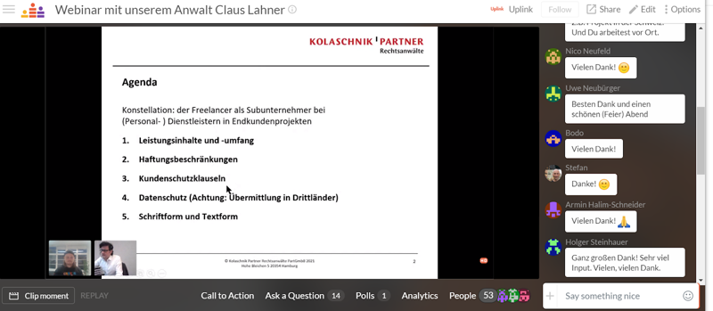

**Nach einer Winterpause freuen wir uns, dass wir letzte Woche wieder ein Webinar mit dem Anwalt unseres Vertrauens [Claus Lahner](https://www.kolaschnik-partner.de/claus-mauricio-lahner.html) für über 50 Teilnehmer veranstalten konnten.**

Claus ist auf den Bereich IT-Recht, (IT-)Vertragsrecht sowie E-Commerce- und Datenschutzrecht spezialisiert. Wir haben auch dieses Mal im Vorhinein unsere Community gefragt, welche Themen sie beschäftigt und diese dann bei der Festlegung der Agenda berücksichtigt. Nach einer kurzen Umfrage haben wir uns dazu entschlossen das Webinar auf Deutsch zu veranstalten, jedoch wurden auch Fragen auf Englisch beantwortet.

<!--truncate-->

Wesentlicher Fokus waren die Herausforderungen für Freelancer bei der Gestaltung von Dienstverträgen mit Endkunden und (Personal-)Dienstleistern bezüglich Leistungsumfang, Haftungsbeschränkungen und Exklusivitätsvereinbarungen. Darüber hinaus haben wir auch über Datenschutz im Zusammenhang des Cloud Acts gesprochen und Claus hat einen Überblick über die rechtlichen Rahmenbedingungen beim digitalen Signieren gegeben. Anschließend konnten alle Teilnehmer ihre individuellen Fragen stellen.

**Das gesamte Webinar wurde aufgezeichnet und kann jederzeit [bei Crowdcast](https://www.crowdcast.io/e/servicecontractfreelancer)nochmal angesehen werden.**

Neben regelmäßigen Webinaren arbeiten wir mit Claus auch bei unserem [Contract Check Service](https://uplink.tech/blog/check-your-recruiter-contracts-with-uplink/) zusammen! Um über unsere aktuellen Events benachrichtigt zu werden,[folgt uns auf Crowdcast](https://www.crowdcast.io/uplink) oder aktiviert die [Emailbenachrichtungen für unsere Onlineevents](https://my.uplink.tech/community/meetups).
