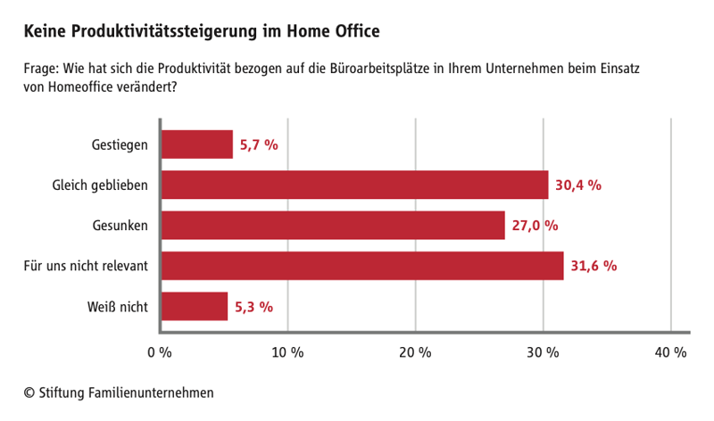

Angestellte, die ihre Homeoffice-Option in Anspruch nehmen haben oft mit Vorurteilen zu kämpfen. Ihnen wird nachgesagt, dass sie sich neben der Arbeit noch um den Haushalt kümmern, kochen oder einfach nur vor dem Fernseher entspannen und so die Arbeit schleifen lassen. Aber ist an diesen Vorurteilen wirklich was dran?

## Die Sicht der Unternehmen

Laut [einer Ifo-Umfrage](https://www.familienunternehmen.de/de/pressebereich/meldungen/2020/2020-11-16/repraesentative-umfrage-homeoffice) geben nur 5,7 % aller befragten Unternehmen an, dass sie eine Steigerung der Produktivität ihrer Angestellten im Homeoffice verzeichnen können. 30,4 % der Unternehmen bemerkten keine Veränderung bei der Produktivität und ganze 27 % aller Unternehmen gaben bei der Umfrage an, dass sie sogar eine Verschlechterung bemerkten.

Das kann womöglich auch darauf zurückzuführen sein, dass Unternehmen soziale Räume sind, in denen Dynamiken für Innovationen geschaffen werden können. Diese Innovationskraft ist nur bedingt durch Videokonferenzen ersetzbar.

## Einschätzung der Mitarbeiter

59% aller Befragten gaben [in einer Studie der DAK](https://www.dak.de/dak/gesundheit/gesundheitsreport-2020-stress-in-der-modernen-arbeitswelt-2365966.html) an, dass sie das Gefühl haben, produktiver im Homeoffice zu arbeiten als im Büro. Das lässt sich womöglich auch darauf zurückführen, dass für Angestellte der Weg zur Arbeit wegfällt, der einem auf die Woche gerechnet einiges an Stunden kostet. Im Homeoffice ist man im Vergleich dazu in wenigen Sekunden an seinem Arbeitsplatz. Darüber hinaus kann die eigene Arbeitszeit besser eingeteilt und mit der Familie und anderen Aktivitäten wie Sport vereinbart werden.

Durch den vermehrten Einsatz von Homeoffice sinkt nicht nur die Ansteckungsgefahr in Zeiten von Corona, sondern auch das Stresslevel der Angestellten. Die Umfrage der DAK ergab, dass 3/4 aller befragten Angestellten das Gefühl haben, im Homeoffice weniger gestresst zu sein. Das Arbeiten mit dem eigenen Laptop, Smartphone und Videokonferenzen scheint also für die Meisten positiv zu sein. Die Befragten gaben an, dass sie das Gefühl haben dadurch eine bessere Work-Life-Balance zu entwickeln.

## Welche negative Auswirkungen können im Homeoffice entstehen?

Das Arbeiten im Homeoffice hat natürlich nicht nur positive Effekte. So fehlt vielen Angestellten der persönliche Kontakt zu den Arbeitskolleg\*innen. Zudem erschwert das Homeoffice die Kommunikation zum Teil erheblich. So ist es nicht mehr möglich sich mal kurz mit dem Chef abzusprechen oder Arbeitskolleg\*innen über den Tisch hinweg etwas zu fragen. Das alles kann zu einer Verlangsamung der Entscheidungsfindung sowie der einzelnen Arbeitsprozesse führen. Darüber hinaus wurde deutlich, dass es insbesondere dem Großteil der unter 30-Jährigen, also denjenigen, die meist noch keine Kinder haben, sehr schwerfällt, eine klare Trennung zwischen Beruflichem und Privatem zu ziehen. Keine klare Trennung wirkt sich negativ auf das Stresslevel und somit die eigene Work-Life-Balance aus.

## Sind wir nun produktiver oder nicht?

[Eine zweijährige Studie der Stanford University](https://www.inc.com/scott-mautz/a-2-year-stanford-study-shows-astonishing-productivity-boost-of-working-from-home.html) kommt zu dem klaren Ergebnis: _ **Ja, Angestellte sind deutlich produktiver im Homeoffice als im Büro.** _ Der Stanford Professor Nicholas Bloom führte die Studie in einem chinesischen Reiseunternehmen mit insgesamt 16.000 Mitarbeitenden durch und fand so heraus, dass die Fluktuation der Angestellten im Homeoffice um rund 50 % sank. Sie machten zudem kürzere Pausen, hatten weniger Krankheitstage und nahmen auch weniger Urlaub. Weiterhin sparte das Unternehmen durch die Beschäftigung eines Teils der Angestellten im Homeoffice im Schnitt 2000 Dollar pro Mitarbeiter im Jahr an Miete. Die Studie konnte so belegen, dass sich das Arbeiten von Zuhause positiv auf die Produktivität der Angestellten auswirkte.

## Fazit

Es gibt positive und negative Seiten an der Arbeit im Homeoffice. Nicht jeder kommt auf Dauer mit der Isolation im Homeoffice klar, doch scheint in der momentanen Situation kein Weg daran vorbeizugehen. Für die Zeit nach der Corona-Pandemie aus wissenschaftlicher Sicht sprechen gute Gründe dafür, seinen Mitarbeitenden weiterhin Homeoffice zu ermöglichen oder zumindest ein hybrides Modell zu fahren. Auch wenn Arbeitgeber\*innen nur bedingt die Möglichkeit haben, ihre Angestellten im Homeoffice zu überwachen, sollten wir uns von jeglichen Formen des Mikromanagements verabschieden und eine positive Kultur des Vertrauen implementieren und so den Mitarbeitenden zumindest einige Tage im Monat das Arbeiten von Zuhause ermöglichen.
