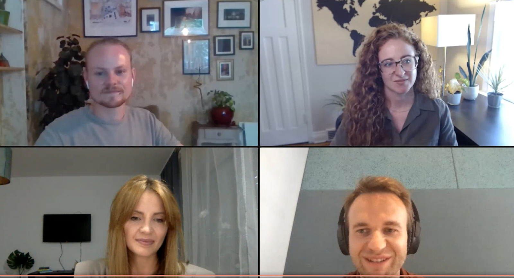
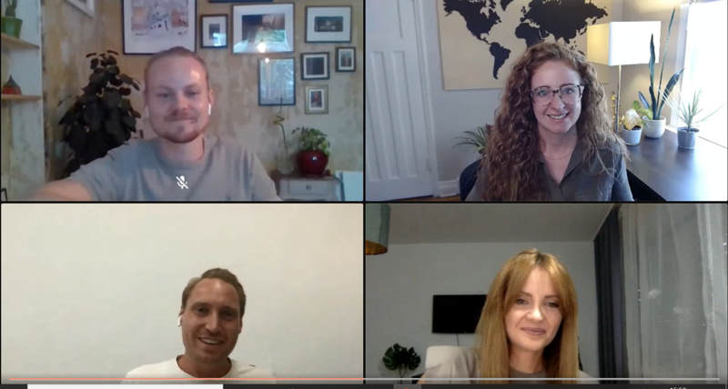

As many of you noticed, we moved from our old office in Berlin-Friedrichshain to the Factory Berlin at Görlitzer Park a few months ago. We intentionally chose Europe's largest coworking space, as it is packed with freelancers as well as exciting startups, and we like to network and shout out to the world: "We are Uplink"! 🥳

This is why we were super excited when Lars Melchior from the Factory [Developers Circle](https://factoryberlin.com/programs/circles/) asked us to participate in a panel discussion together with experts from other freelancing platforms. The panelists were [Margaux Miller](https://www.linkedin.com/in/margauxmiller/), Head of Community at [Toptal](https://www.linkedin.com/company/toptal/), [Marc Clemens](https://www.linkedin.com/in/marcclemens/), Founder and CEO at [CodeControl](https://www.linkedin.com/company/codecontrol/), and yours truly, [Nick Oestreich](https://www.linkedin.com/in/nick-oestreich-075218135/), who is responsible for business development and community management at Uplink. The whole session was moderated by [Ileana Sofronie](https://www.linkedin.com/in/ileana-s-b219014b/), who works as a freelance UX designer.

Here are some impressions from the event:

Already during the short intro round, the participants had the chance to pose questions that they would like the experts to answer. This made for a very interactive exchange and almost all the participants' questions were addressed:

- Who should consider working as a freelancer?
- Why should you register at a freelance platform?
- What skills and/or tech stack should a freelancer have?
- What kind of clients can you expect and what is a typical project duration?
- What makes your platform unique for freelancers?
- What general advice would you give to someone thinking about freelancing?

We were delighted about the great feedback after the event! 🙇‍♂️

The whole event was recorded and [you can rewatch it at any time](https://www.crowdcast.io/e/3rm2kp24).
