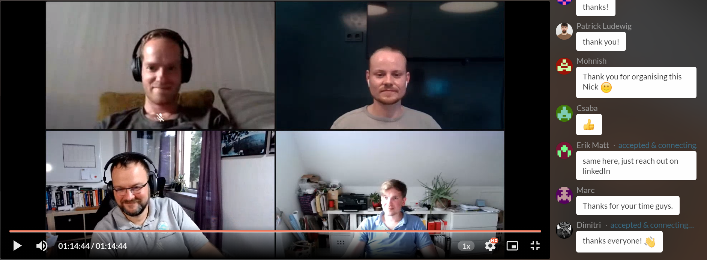

**We would like to say thank you for the great joint event we had last week with three freelancers from the Uplinkverse, which was attended by more than 50 people. Especially the interactive part was a lot of fun! 🤗**

The participants were:

- [Erik Matt](https://www.linkedin.com/in/erik-matt-727b996a/), who helps his clients to be prepared for exceptional situations and supports them to set new courses during times of crisis.
- [Holger Steinhauer](https://www.linkedin.com/in/holgersteinhauer/), owner of steinhauer.software, the backend for startups and SMEs. He supports his clients with tailor-made software to make their business more successful.
- [Dimitri Abalenkov](https://www.linkedin.com/in/dimitriabalenkov/), who has worked as a Product Manager/Product Owner for the last 5+ years. He has experience working both with SMEs like Betterplace Academy or Scout24, as well as big corps like Deutsche Bank. Financial industry and frontend-facing projects belong to his strengths.

Before and during the event, all participants had the opportunity to ask their questions and almost all of them could be answered. 🚀 Here are a few highlights:

- Should I try to “productize” my services?
- How can I acquire more of the projects and clients I really like to work with?
- Which ways to get into direct contact with clients (without a recruiting company) did work best for you?
- What specialisation should I choose? Shall I go “niche expert” or “jack of all trades”?
- Why do companies ask recruiting companies to find freelancers (most of the times) instead of reaching out to freelancers directly (via social networks for example)?
- As a freelancer should I put effort/time/money into doing certifications (or any other "proof of skills") to stick out from competition?
- What suggestions would you give someone who is trying to find their first client as a freelance developer?

The Webinar was recorded and you can rewatch it at any time [on our Crowdcast site](https://www.crowdcast.io/e/uplinkdeepdivefreelancing).

---

_Would you like to hear about future webinars like this one? Follow [our Crowdcast page](https://www.crowdcast.io/uplink) to stay in the loop!_
