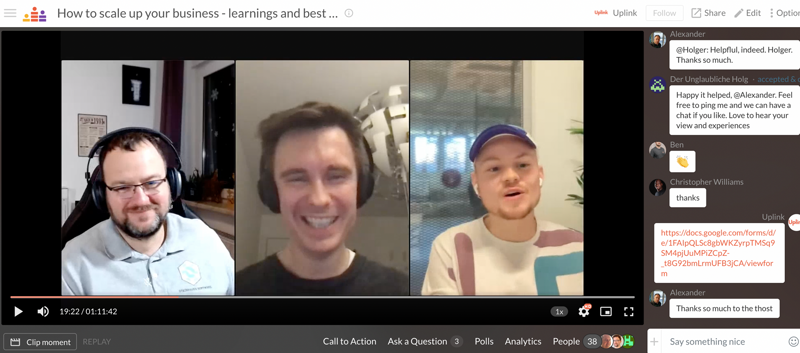

Since the end of 2021, we have had a successful cooperation with [Qonto](https://qonto.com/), and we are thrilled with their offering and compatibility with other services from our partners such as [Accountable](https://www.accountable.de/). We are even more excited that Qonto shared its success story with the members of the Uplinkverse in our last webinar! 🧑‍💻

<!--truncate-->

Last week, Nick from our team spoke with Holger from the Uplink community and Torben, the Country Manager Germany from Qonto, about best practices and the challenges of scaling up your business. Torben is passionate about the future of Financial Services, as well as the Future of Work. Holger is the owner of steinhauer.software, an IT consulting agency. He supports his clients with tailor-made software to make their business more successful.

Some highlights of the webinar were:

- Qonto's personnel strategy in the early stage
- First steps on the way to become a Grown-up
- Distribution channels and financial planning
- Collaboration with VCs and other investors

The sharing of insights about market reactions, especially at the beginning of a product launch, were particularly fascinating. The speakers also had lots of helpful advice about marketing, product placement, and successful networking. During the event, all participants had the opportunity to ask their questions and all of them could be answered. 🙌

You can rewatch the event at any time on [our Crowdcast page](https://www.crowdcast.io/e/uplinkqontoscaleyourbusiness). If you are one of the first 30 participants who take part in the feedback survey for the event, you will receive a 10€ Wolt voucher. 🍲
