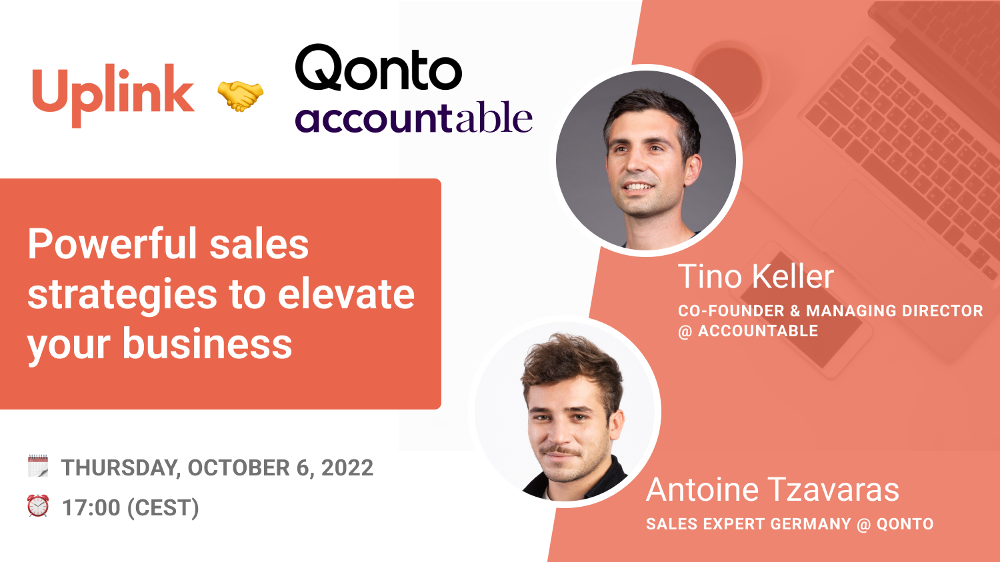

Last week we hosted the third “Deep Dive” webinar &nbsp;in our joint long-term event series "How to scale up your business" with our partner[Qonto](https://qonto.com/de). The topic this time was "Powerful Sales Strategies" - Nick from the Uplink team talked to [Antoine Tzavaras](https://www.linkedin.com/in/antoine-t-81963b130/), Sales Expert of Qonto, and [Tino Keller](https://www.linkedin.com/in/tinokeller/), Co-Founder & Managing Director of our partner [Accountable](https://www.accountable.de/).

Some highlights of the webinar were:

- Challenges in the early stage of a start-up
- Key elements of a successful sales strategies
- Development of classic sales approaches
- Challenges in sales when entering new markets in other countries
- Obstacles in the finance sector/ in the context of products that require explanation
- Best/worst practices

It was super fascinating to learn that **not every sales strategy requires a large team of salespeople**, but it can also be an effective way to attract the attention of the target group at an early stage through marketing measures long before the actual need for the product arises. Accountable, for example, has developed a variety of tools that support freelancers as soon as they consider starting out as freelancers. When expanding in foreign countries, you should be aware that the effort can be compared with the workload of launching a new product. While in France checks are still used frequently, in Germany a German IBAN is mandatory to increase the level of trust in a bank account.

**_On previous webinars, we already discussed some other topics to support you in scaling up your business. We started with insights about how to go from MVP to Unicorn and finding your product-market-fit. In the last event, Torben shared his insights about the best recruiting strategies. All events have been recorded and can be rewatched at any time. Stay tuned by following_** [**_our Crowdcast page_**](https://www.crowdcast.io/e/recruitingstrategies) **_!_**

If you don't know Qonto yet, you can check them out with our deal for Uplink members: you receive the first 6 months (smart plan) of your subscription for free. If you want to test out Accountable, you can try their service 6 months for free as well. You can find all details in the [cooperations section in the member area](https://my.uplink.tech/partners). 🎉
