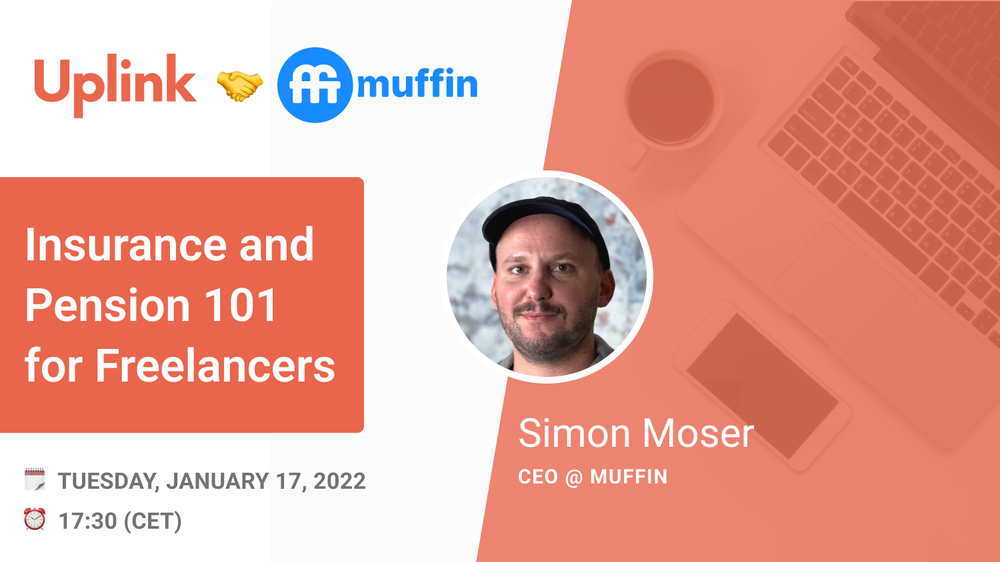

We are very happy to announce our brand new cooperation with [muffin](https://www.getmuffin.de/), an insurance service that helps you to select the right insurance package and assists you with the whole setup. They also support you with the management, tracking and switching process from other providers. If you don't speak German, you can complete the entire process in English!

<!--truncate-->

What's particularly exciting about muffin is their all-digital approach - &nbsp;you can simply reach out to your insurance broker via WhatsApp and find out, for example, whether it makes sense for you to switch from public to private health insurance.

To kick off our partnership, we hosted a joint webinar with [Simon Moser](https://www.linkedin.com/in/moser-simon/) & [Tomas Gan](https://www.linkedin.com/in/tomas-gan/), two of muffin's co-founders, on “Insurance and Pension 101 for Freelancers”. More than 60 people attended. 🙌

Some highlights of the webinar:

- Differences between private and public health insurance
- Particularities of ETF pension plans
- Importance of the national "Rentenversicherung" 
- Investment strategies for pension schemes
- Tax aspects of several products and insurance

One of the most interesting aspects was the discussion of the tax benefits of various products and the elimination of many common preconceptions about private health insurance.

If you missed the webinar, you can rewatch it here:

<emb>https://uplink.tech/webinars/116c9e-2023-01-17-insurance-and-pension-101-for-freelancers</emb>

And if you're interested in the slides that were used, you can find them [here](https://drive.google.com/file/d/1vNt-kayGLiOsJgFhcrMdAhQdqzJkKqOt/view?usp=sharing).

_ **We are looking forward to**  **a long and fruitful**  **cooperation with**  **muffin****!**_
