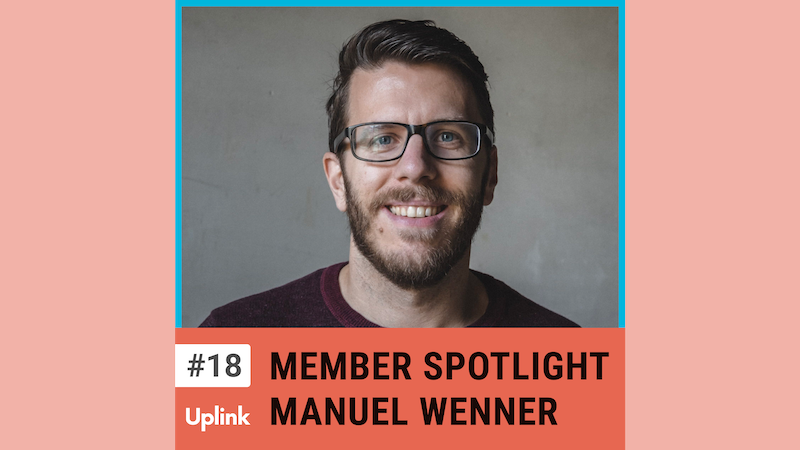

In dieser Episode spreche ich mit Manuel Wenner aus der Uplink Community. Manuel hat in seiner Laufbahn schon einiges erlebt: er hat eine Agentur mitgegründet und 8 Jahre lang geführt, war danach CTO eines Startup Studios und hat u.a. für Daimler kleine Teams bei der MVP-Entwicklung begleitet, ist Dozent an der DHBW und seit Dezember 2022 wieder als Vollzeit-Freelancer aktiv.
Wir sprechen über die Vor- und Nachteiler kleiner und mittelständiger Kunden gegenüber Konzernen, eine gesunde Arbeitseinstellung als Papa eines 4jährigen Sohnes und warum LinkedIn heutzutage unverzichtbar ist, man manchmal aber einfach eine Pause davon braucht.

<!--truncate-->

Hier könnt ihr euch die Episode anhören:

<emb>https://uplink.tech/podcast/18-member-spotlight-manuel-wenner-ueber-seine-erfahrungen-als-cto-eines-startup-studios-work-life-balance-als-kleinkind-papa-und-die-hassliebe-zu-linkedin</emb>

---

Erwähnungen in dieser Episode:

* Hatchery: https://www.hatchery.io/
* Why is LinkedIn so weird?: https://www.youtube.com/watch?v=IMfBS4mBfBQ
* Goodlance: https://goodlanceapp.com/
* Nie wieder krank: https://www.amazon.de/dp/374230562X/

Kontaktieren könnt ihr Manuel über den Uplink Slack, LinkedIn oder seine Webseite:

* https://www.linkedin.com/in/manuel-wenner/
* https://www.manuelwenner.de/
