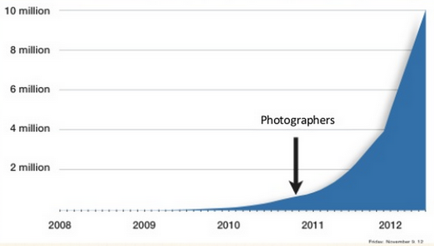

> Alle gescheiterten Unternehmen sind gleich: Sie haben es nicht geschafft, sich dem Wettbewerb zu entziehen.

– Peter Thiel

Das obige Zitat, welches wir bereits im ersten Artikel nennen, stammt aus Peter Thiels Buch: “Zero to One: Notes on Startups, or How to Build the Future”. Und es geht heutzutage nicht nur darum, der Konkurrenz ein Schnippchen zu schlagen. Es geht auch darum, als Unternehmen eine starke Resilienz auf die Krisen und Geschehnissen unserer Zeit zu entwickeln.

:::info

Dies ist der zweite Teil unserer Serie „Mit Freelancern die Chancen der Krise nutzen“. Im ersten Artikel geben wir eine grobe Übersicht, welche Chancen und Möglichkeiten durch Freelancer für Unternehmen möglich sind. In diesem Teil erfährst du, wie Freelancer KMU die benötigte Resilienz verschaffen, als auch die Möglichkeit, durch Innovation einen Sprung nach vorne zu machen und einer überlegenen Konkurrenz die Stirn zu bieten – genau dann, wenn es keiner erwartet. Freut euch im Laufe dieser Serie auf weitere spannende Themen wie Employee Wellbeing, Diversifizierung (DEIB) und mehr.

:::

<!--truncate-->

## VUCA World

Der Begriff [VUCA](https://de.wikipedia.org/wiki/VUCA) stammt ursprünglich aus dem amerikanischen Militär und steht für Volatility, Uncertainty, Complexity und Ambiguity. Also Volatilität oder Unbeständigkeit, Unsicherheit‚ Komplexität und Mehrdeutigkeit. Die Pandemie, der Krieg in der Ukraine und nicht zuletzt das Erdbeben in der Türkei und Syrien bestätigen das unweigerlich. Bei allen Krisen steht häufig die Lieferkette in der ersten Reihe und unterliegt in aller Regel als Domino-Effekt den globalen wirtschaftlichen Folgen, die uns letztendlich alle betreffen. Besonders heikel ist das für KMUs, für die Krisen dieser Art zu einem Überlebenskampf werden können.

Der Wikipedia-Artikel zum Thema VUCA liefert eine erste Strategie zum Überleben in der VUCA-Welt, die sich ebenfalls von dem Akronym ableitet:

* Vision (Vision)
* Understanding (Verstehen)
* Clarity (Klarheit)
* Agility (Agilität)

Agilität ist dabei mehr als ein Buzzword und bietet mit die beste Antwort auf unerwartete Herausforderungen, die niemand vorhersehen kann.

## Freelancer – deine Verbündeten in einer VUCA-Welt

Wir wollen jetzt nicht allzu militärisch klingen, aber Freiberufler sind in der Tat sozusagen “your best shot", um auf Krisen zu antworten und eine Wettbewerbs- und Widerstandsfähigkeit in deiner Organisation zu erzeugen. Denn Freelancer sind in aller Regel erfahrene, innovative, unabhängige, selbstmotivierte und zuverlässige Fachkräfte, die je nach Projektanforderung remote oder vor Ort arbeiten. Hierbei bieten sie eine qualitativ hochwertige, schnelle, vielseitige, kreative und kooperative Art, Dienstleistungen und Produkte für KMUs zu erbringen.

Durch ihre Unabhängigkeit sind Freelancer auch vor allem nicht emotional beeinträchtigt, sollte es einem Unternehmen nicht so gut gehen oder viel auf dem Spiel stehen. Hier können sie Objektivität und Ruhe bewahren und sich vollends auf das entsprechende Projekt konzentrieren.
Beim Schreiben dieser Zeilen müssen wir plötzlich an den Film “[Baby Driver](https://www.youtube.com/watch?v=vhvbEs9xtD4)” denken, in dem der Protagonist genau geforderte Contenance bewahrt und professionell seinen Job durchzieht.

Aber zurück zur realen Welt – Freiberufler sind weiterhin nicht nur kosteneffizient, sondern eben auch dynamisch, anpassungsfähig und skalierbar. Das ermöglicht es KMUs, zeitnah und effizient auf veränderte Marktanforderungen, Bedürfnisse der Klientel oder Geschäftsziele zu reagieren.

Das Leben in einer VUCA-Welt bedeutet, dass Unternehmen mit einem immer höheren Maß an Agilität und Flexibilität arbeiten müssen. Es reicht nicht mehr aus, einfach nur Strategien zu planen und daran festzuhalten; stattdessen müssen Unternehmen in der Lage sein, sich schnell anzupassen und bei Bedarf umzuschwenken. Diese neue Realität erfordert von den Unternehmen eine ständige Bewertung ihrer Prozesse und Praktiken und die Suche nach neuen Wegen, wie sie ihre Ressourcen optimal nutzen können. Freiberufler sind eine ideale Lösung, da sie flexibel eingesetzt werden können und schnell Teil des Teams werden, ohne den traditionellen Einstellungsprozess durchlaufen zu müssen.

## Expertise auf Abruf

Der Hauptvorteil des Einsatzes von Freiberuflern besteht darin, dass Unternehmen schnell Zugang zu spezialisierten Fähigkeiten und Fachkenntnissen erhalten können – und das äußerst kosteneffizient. Indem sie die spezifischen Fähigkeiten von Freelancern nutzen, können Organisationen ihre Qualifikationslücken schließen und je nach Bedarf schnell auf- oder abrüsten. Und dank dieser Flexibilität können sie schneller auf sich ändernde Marktbedingungen reagieren, anstatt darauf warten zu müssen, dass ein Vollzeitmitarbeiter eingestellt oder gar ausgebildet wird. Das kostet nicht nur mehr Geld, sondern braucht auch seine Zeit. Freiberufler bieten hier eine zusätzliche Ebene von Sicherheit, da sie in der Regel nicht durch langfristige Verträge oder Sozialleistungen gebunden sind, was sie ideal für kurzfristige Projekte macht.

## Legenden basieren darauf

Das bedeutet, dass sich MVPs und andere Testballons ideal mit Freelancern umsetzen lassen.
Und hier können sich sowohl einige Silicon Valley als auch europäische Erfolgsstories einreihen. Airbnb hat in seiner [faszinierenden Geschichte](https://producthabits.com/how-two-designers-created-airbnb-and-turned-it-into-a-30-billion-company/) durchweg auf diese Strategie gesetzt, ob für die Entwicklung neuer Funktionen und die Verbesserung der Benutzerfreundlichkeit. Auch für die Erstellung von Inhalten, wie das Schreiben von Blogbeiträgen und das Erstellen von Videos, kamen Freelancer zum Einsatz. Doch den ersten wesentlichen Erfolg hatten die Gründer Brian Chesky und Joe Gebbia durch den Einsatz von freiberuflichen Fotografen. Chesky und Gebbia hatten festgestellt, dass die Inserate der Gastgeber mehr schlecht als recht angefertigt wurden und vor allem die Fotos der Angebote ließen stark zu wünschen übrig. Viele Bilder waren schlecht beleuchtet oder wurden mit einer Handykamera aufgenommen – deren Ergebnisse 2009 noch ziemlich schlecht waren. Selbst die besseren Fotos waren fade, gewöhnlich und unattraktiv.

Die Antwort auf dieses Problem war einfach: bessere Fotos von Airbnb-Angeboten machen. Die tatsächliche Umsetzung dieser Lösung war jedoch schwieriger als gedacht. Airbnb hätte Richtlinien für die Bildqualität einführen und Gastgebern verbieten können, Bilder von schlechter Qualität hochzuladen. Oder hätte eine Kampagne starten können, um Gastgebern die Grundlagen der digitalen Fotografie beizubringen und so die Bildqualität in der Airbnb-Community zu verbessern.

Doch stattdessen mieteten Chesky und Gebbia eine 5.000-Dollar-Kamera und machten die Bilder selbst. Und das Ergebnis kam prompt. Bereits kurz nachdem sie bessere Fotos von ihren Angeboten in New York gemacht hatten, verdoppelten sich die Einnahmen aus den Objekten in der Stadt. Chesky und Gebbia übertrugen ihren DIY-Ansatz dann sukzessive auf andere Städte.

Nach diesem Erfolg hätte Airbnb die Arbeit auf die Nutzer abwälzen können mit Richtlinien für Bildqualität und Schulungen, wie gute Fotos gemacht werden. Doch mit freiberuflichen Fotografen konnte das Unternehmen vorhersehbar und mit rascher Geschwindigkeit skalieren. Und Geschwindigkeit ist wichtig bei “Zero to One”-Projekten, in etwa wie bei Sportwagen von “Zero to One Hundred" zu kommen, also von Null auf 100. Mit Freelancern kommen Unternehmen auf Geschwindigkeit. Und schon wieder müssen wir an “Baby Driver” denken ;-)

## Wettbewerbsfähigkeit und Widerstandsfähigkeit

Eine weitere Geschichte aus dem Valley zeigt uns, dass es nicht nur um Geschwindigkeit geht, sondern auch um Innovation. Viele von euch denken jetzt sicherlich an Apple. Sicherlich hat auch Apple einiges durch Freelancer erlangt, wie beispielsweise [den Namen für den beliebtesten mobilen Musikplayer seiner Generation, den iPod](https://creativepool.com/magazine/inspiration/vinnie-chieco--the-freelance-copywriter-who-named-the-ipod-.1550).

Doch es geht hier um die Firma Square. Oder konkreter, um Square vs. Amazon, den Nummer 1 Prädator in der Geschäftswelt und der schlimmste Gegner, den man sich im Business vorstellen kann. Dies ist die Geschichte von David gegen Goliath, eine nicht minder faszinierende Story über Entrepreneurship und die Macht des “Innovation Stacks”.

Square wurde von Jim McKelvey und Jack Dorsey gegründet. Dorsey hatte zuvor Twitter gegründet, deswegen hatten die beiden einen guten Start – bis Amazon auf den Plan trat.

Zum Hintergrund: Das erste Produkt der Firma Square, das im Jahr 2009 auf den Markt kam, war ein kleines mobiles Kartenlesegerät – es ermöglichte Händlern, Kreditkartenzahlungen über ihr Smartphone oder Tablet zu akzeptieren. Das Gerät konnte in den Kopfhöreranschluss eines mobilen Geräts gesteckt werden und funktionierte in Verbindung mit einer mobilen App, die die Zahlungsabwicklung ermöglichte. Ziel des Geräts war es, Händlern ohne Zugang zu herkömmlichen Geräten zur Zahlungsverarbeitung eine einfache Möglichkeit zu geben, Kreditkartenzahlungen anzunehmen. Stein des Anstoßes war das Ärgernis von Jim McKelvey, der seinerzeit Glasbläser war, einen Kunden abzulehnen, der ein Produkt mit einer American Express Karte bezahlen wollte. Das sollte sich mit Square ändern.

Das Produkt von Square entwickelte sich großartig, was nicht unbemerkt an Amazons Gründer Jeff Bezos vorbeiging. Amazon kopierte daraufhin die Hardware, bot das Produkt für einen 30% günstigeren Preis an und offerierte einen Live-Kundensupport. Bam. Ein Schlag ins Gesicht von Square, die weder gegen eine Armee an Support-Mitarbeiter kämpfen konnten, geschweige denn sich auf einen Preiskampf mit dem E-Commerce-Giganten einlassen wollten. Was also tun in einer solchen Situation?

*Square entschied sich, eines zu tun: nichts.*

Genauer gesagt, sie konzentrierten sich nun umsomehr um ihr Produkt, und den sogenannten “Innovation Stack”. Dieser Innovationsstapel von Square umfasste eine Reihe von Lösungen, von der Entwicklung eines neuartigen Kreditkartenlesegeräts bis hin zur Schaffung eines völlig neuen Geschäftsmodells für die Zahlungsabwicklung. Fast jedes Mal, wenn Square ein Problem gelöst hatte, wurde ein weiteres Problem geschaffen, was ebenfalls eine einzigartige Lösung erforderte. Diese sich wiederholende Kette von Problem-Lösung-Problem ist ein Innovationsstapel. Und dieser Innovation Stack ist schwer zu replizieren – sogar für eine mächtige Firma wie Amazon.

Der heftige Kampf zwischen Square und Amazon dauerte mehr als ein Jahr. Doch McKelvey und Dorsey gelang schließlich das Unmögliche: Durch Beharrlichkeit, Entschlossenheit und ständige Innovation hatten sie das furchterregendste Unternehmen der Welt besiegt.

Um solch eine Wettbewerbsfähigkeit zu erreichen, müssen Organisationen eine Kultur der Innovation schaffen. Freelancer bringen fast immer neue Perspektiven und neue Ideen mit, die letztendlich Innovation fördern und Firmen helfen können, der Konkurrenz voraus zu sein – oder um nicht kopiert zu werden durch die Schaffung eines Innovation Stacks.

## Fazit

Die Geschichte von Square und Airbnb zeigt, wie wichtig Innovation und Agilität im Marktumfeld sind. Durch die Einführung innovativer Lösungen können Unternehmen sicherstellen, dass sie in einer sich schnell verändernden Landschaft wettbewerbsfähig bleiben. Dadurch schaffen es Unternehmen, eine Krise in eine Chance zu verwandeln und etwas wirklich Außergewöhnliches zu schaffen, wo andere bereits das Handtuch werfen. Die kreativen Ideen, die Agilität und die frische Perspektive von Freiberuflern haben maßgeblich Einfluss hierauf.

Die Lektionen von Square sollten uns alle ermutigen, über den Tellerrand hinauszuschauen und schwierige Zeiten zu nutzen, um vorausschauende Schritte einzuleiten – denn wie heißt es so schön? Fortes fortuna adiuvat – das Glück ist mit den Tüchtigen. Packen wir es also an!
