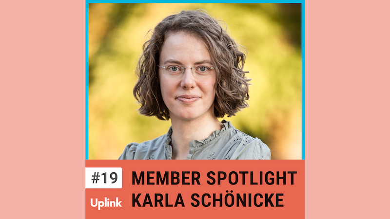

Die heutige Folge ist für mich eine ganz besondere! Mein Gast ist Karla Schönicke, Gründerin des "Women CTO Dinner" und der ersten "Female Business Angel Academy", die Frauen zu Investorinnen ausbildet. Die meiste Zeit unterstützt sie allerdings Unternehmen als Freelance Product Lead und ist zudem selbst als Venture Scout bei Ananda Impact VC auf der Suche nach spannenden Startups.

Wir sprechen über ihre Leidenschaft für das Produktmanagement, Rollenbilder und gesellschaftliche, aber auch politische Handlungsfelder für mehr Diversität und Inklusion. Außerdem geht es um die Bedeutung von Communities und darum, was jede Person bereits jetzt schon für eine inklusivere Welt tun kann.

Ressourcen, die in dieser Episode erwähnt werden:

Women CTO Dinner 
https://womencto.eu/

FIN Academy 
https://female-investors-network.com/academy/

Ananda Impact Ventures 
https://ananda.vc/

Kontaktieren könnt ihr Karla über LinkedIn oder ihre Webseite: 
https://www.linkedin.com/in/karlaschoenicke 
https://karlawithakey.com/

<!--truncate-->

Hier könnt ihr euch die Episode anhören:

<emb>https://uplink.tech/podcast/19-member-spotlight-karla-schoenicke-ueber-diversity-inklusive-produktentwicklung-und-dysfunktionale-strukturen-in-der-tech-szene</emb>
