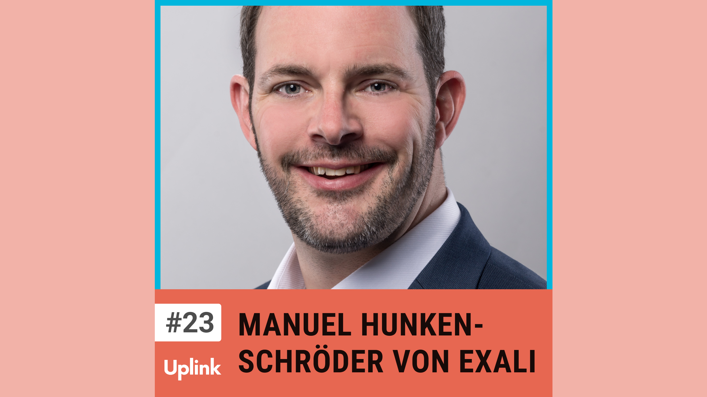

In unserer heutigen Folge habe ich Manuel Hunkenschröder von Exali zu Gast. Exali ist ein Versicherungsanbieter, deren Versicherungen mittlerweile in über 19 Ländern verfügbar sind. Manuel verantwortete das Produktdesign und die Expansion.

Wir sprechen über die Vorbereitungsarbeit sowie mögliche Strategien, um Services erfolgreich im Ausland zu launchen. Es geht unter anderem um die Identifizierung passender Marketingkanäle und externe Unterstützungsmöglichkeiten. Außerdem erfahrt ihr, in welchen Fällen es sich lohnen kann, die Füße ohne viel Vorbereitung ins Wasser zu halten.

Ressourcen, die in dieser Episode erwähnt werden:

Exali 
https://www.exali.de/

Loom 
https://www.loom.com/

Greenshot 
https://getgreenshot.org/

Geschichten aus der Geschichte 
https://www.geschichte.fm/

Die Lage der Nation 
https://lagedernation.org/

Kontaktieren könnt ihr Manuel über LinkedIn: 
https://www.linkedin.com/in/manuel-hunkenschr%C3%B6der-205562112

<!--truncate-->

Hier könnt ihr euch die Episode anhören:

<emb>https://uplink.tech/podcast/23-manuel-hunkenschroeder</emb>