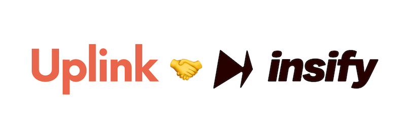

We are very excited to announce our brand new cooperation with [insify](https://www.insify.de/uplink/?utm_medium=partner&utm_source=uplink&utm_campaign=main), an insurance provider that offers multiple insurances for freelancers and self-employed professionals.

Their insurance options range from business liability and professional liability to property insurance. This way consultants, coaches, developers as well as marketing experts will find tailor-made coverage.

**As fans of digital, asynchronous solutions, we really like the fact that you can subscribe to almost all insurance plans completely online and cancel them on a daily basis. This way, you only pay for the service for the period that you actually need them.**

To kick off our partnership, we talked to [Koen Thijssen](https://www.linkedin.com/in/koen-thijssen-2558462a/), Founder and CEO of insify, in our podcast. He shared his best practices for to team building and prioritization, and we talked about the InsurTech industry's particularities and the commonalities between investment banking and the insurance industry. **Stay tuned - the episode will be released in early September!** 🚀

To give you a better impression of our newest partner, we asked insify these five tough questions:

## What makes you stand out amongst other insurance providers in Europe?

Picture the typical insurance company in Europe: an institution steeped in a 180-year legacy, burdened by archaic processes and products. We've noticed how the insurance industry has lost touch with its true purpose: supporting entrepreneurs and small businesses when they need it the most. Unlike others, who often prioritize profits and legacy systems, insify puts the customer first.

Our journey began with a realization: traditional insurance didn't have the customer's back. When our founder Koen faced a claim, he found himself unsupported although he had the right coverage and always paid his premium on time. This gap led him to reimagine insurance – insify was created. We vowed to simplify the complex, streamline the tedious, and amplify fairness. Our four-pronged approach centers on automating processes, accurately pricing risk, detecting fraud, and delivering a claims experience that combines automation with a human touch.

## Freelancers often work across national borders. Is your insurance solution designed with an international focus to also support globally active freelancers?

The modern freelancer knows no borders, and neither should their insurance. insify's solution is designed with a global mindset, crafted to support freelancers who venture beyond national confines. However, to ensure affordable pricing, we are currently not covering freelancers who work with customers from the US and Canada. This way, we can continue offering competitive rates while maintaining our international focus.

## Freelancers from different industries often have different insurance needs. How do you address the challenge to develop a tailor-made solution for each freelancer?

Freelancers span a myriad of industries, each with distinct insurance requirements. Our secret lies in understanding the nuances of their professions. We invest time and effort to grasp their needs, risks, and pain points. We ask questions that resonate with them, building products in their language and tailored to their circumstances. From covering product liability for EU e-commerce sellers to addressing risks for hairdressers that at the same time run a product retail business and create content for their social media – we ensure their unique needs are met.

## Let's be honest: are there any cases where freelancers don't need any insurance and where the risks of a claim are very low?

There are two sides to this coin: there can be a low risk, but a high severity. Think of a roofer accidentally burning down a house on the job - which hardly ever happens, but if it does, you want your roofer to be insured. What's even more problematic is that many insurers aim to sell insurance with no deductible. This drives up premiums and makes absolutely no sense. No one wants to go through the trouble of filing a claim for, say, €50 - especially if you're a freelancer and your time is your most important asset. You would probably rather have lower insurance premiums and insure only what you need. insify offers a range of deductibles, from risk-averse to risk-embracing options. It's about empowering freelancers to align their coverage with their reserves and preferences, ensuring they don't overspend on unnecessary insurance.

## What is your vision for the next 5 years?

At insify, we're fueled by a love for entrepreneurship and the indispensable role freelancers play in society. Our vision for the next 5 years is clear: to be the driving force behind change in the insurance sector. We're committed to ensuring every entrepreneur across Europe gains access to the insurance they truly deserve. Our goal remains steadfast: to keep entrepreneurs moving forward, making insurance a fast, simple, and fair tool that fosters their growth. In a world where legacy insurers struggle to evolve, insify emerges as the fresh, innovative solution for the modern freelancer. We're rewriting the narrative of insurance, reshaping it as a catalyst for entrepreneurship. Join us on this transformative journey and experience insurance that stands for you, by your side, and ready to support you whenever you need it.
