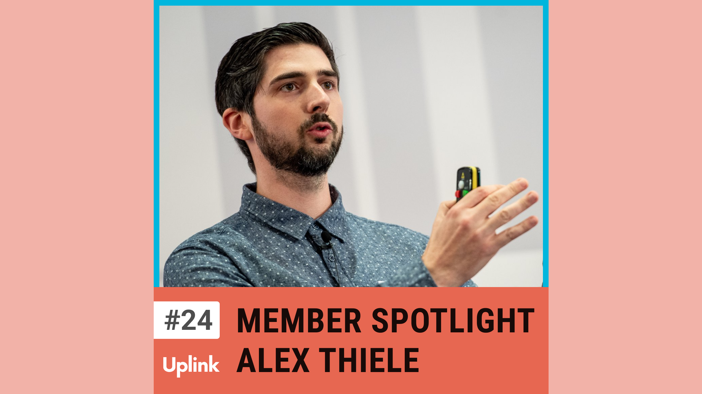

Heute sprechen wir mit Alex Thiele aus der Uplink Community. Er arbeitet als Mobile Developer für ein Startup in Frankfurt, für sein eigenes Startup LinkFive, das "Flutter In-App Subscription Management" anbietet, nimmt er sich abends und am Wochenende Zeit. Außerdem hostet er den "Solana NFT Podcast", ist seit einem halben Jahr frischgebackener Vater und war zusammen mit seiner Partnerin schon fünf Wochen mit Baby in Japan unterwegs. 
Wir sprechen unter anderem über die Themen Mental Health, wie Alex es schafft, seine viele verschiedenen Aufgaben zu organisieren, ohne sich überfordert zu fühlen, und dass er überlegt, LinkFive in der Zukunft zu einem Open Source bzw. "Open Core" Projekte zu machen.

Ressourcen, die in dieser Episode erwähnt werden:

LinkFive 
https://www.linkfive.io/

Solana NFT Podcast 
https://www.solcast.de/

LanguageTool 
https://languagetool.org/de

Getting Things Done 
https://www.amazon.de/dp/0143126563/

Todoist 
https://todoist.com/

Kontaktieren könnt ihr Alex über den Uplink Slack, LinkedIn oder seine Webseite: 
https://www.linkedin.com/in/athiele/ 
https://thiele.dev/

<!--truncate-->

Hier könnt ihr euch die Episode anhören:

<emb>https://uplink.tech/podcast/24-alexander-thiele</emb>