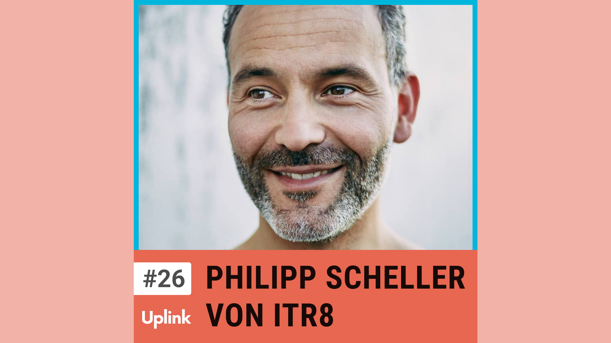

In unserer heutigen Folge haben wir Philipp Scheller, den Gründer und Geschäftsführer von ITR8 zu Gast. ITR8 ist eine Unternehmensberatung, die Kunden bei Transformationsprozessen ihrer Organisations- und Geschäftsmodelle unterstützt, sodass diese einen nachhaltigen Mehrwert für Kunden, Mitarbeiter:innen und die Gesellschaft stiften können.

Wir sprechen über die Grundprinzipien von Agilität und die Herausforderungen von Veränderungsprozessen auf Organisations- und persönlicher Ebene. Außerdem erfahrt ihr mehr über die Eigenschaften, auf die es als Agile Coach ankommt und darüber, wie es ist, in Philipps Team zu arbeiten.

<!--truncate-->

Hier könnt ihr euch die gesamte Episode anhören:

<emb>https://uplink.tech/podcast/26-philipp-scheller</emb>

Intrinsify 
https://intrinsify.de/

Bernd Oestereich & Claudia Schröder 
https://kollegiale-fuehrung.de/

Gitta Peyn 
https://www.linkedin.com/in/gittapeyn-formwelt/

Niels Pflaeging 
https://www.linkedin.com/in/niels-pflaeging-11a89/

Dr. Gerhard Wohland 
https://www.projektmagazin.de/autor/dr-gerhard-wohland

Kontaktieren könnt ihr Philipp über LinkedIn oder die Website von Itr8: 
https://www.linkedin.com/in/philipp-gonzales-scheller/ 
https://www.itr8.io/

Offene Stellen

Scrum Master 
https://join.com/companies/itr8/9025167-scrum-master-m-w-d

Agile Coach 
https://join.com/companies/itr8/9025171-agile-coach-m-w-d