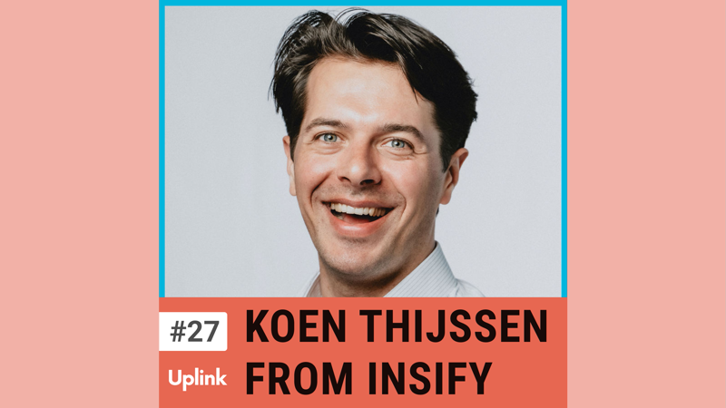

On today's episode, our guest is Koen Thijssen, founder and CEO of Insify. The InsurTech startup offers tailored insurance solutions for freelancers.

We talk about the InsurTech industry's particularities, which are governed by many different regulatory requirements. You will find out what investment banking and the insurance industry have in common. Besides that, you will learn more about the best strategies to prioritize decisions properly and how to successfully build a team of more than 60 people within a short period of time.

<!--truncate-->

<video controls="controls" src="https://uplink.tech/rails/active_storage/blobs/redirect/eyJfcmFpbHMiOnsibWVzc2FnZSI6IkJBaHBBcloyIiwiZXhwIjpudWxsLCJwdXIiOiJibG9iX2lkIn19--a1faa13c07df7a19a466efcb39c8a25ad84f5fc2/nick-koen_full_length%20sep%2018,%20(1).mp4"></video>

Listen to the full episode here:

<emb>https://uplink.tech/podcast/27-koen-thijssen</emb>

Mentioned in this episode:

Slack 
https://slack.com

Grit: The Power of Passion and Perseverance 
https://www.amazon.com/Grit-Passion-Perseverance-Angela-Duckworth/dp/1501111108

You can contact Koen on LinkedIn: 
https://www.linkedin.com/in/koen-thijssen-2558462a/
