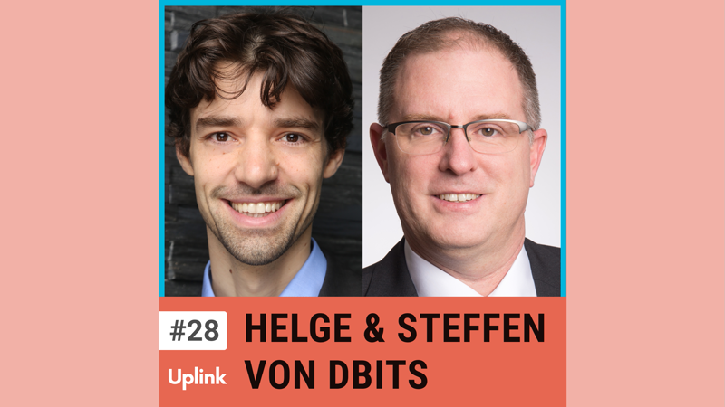

Unsere heutigen Gäste sind Helge Meyer und Steffen Köhler vom Deutschen Bundesverband Informationstechnologie für Selbstständige (kurz: DBITS e.V.). Der Verein setzt sich auf politischer Ebene für die Interessen von IT-Freelancern ein.

Wir sprechen über politische Ziele, die Herausforderungen von Vereinsarbeit und über Lobbyarbeit. Darüber hinaus erfahrt ihr, wie sich der DBITS für die Rechtssicherheit von Freelancern und Unternehmen in Bezug auf Scheinselbstständigkeit einsetzt und welche weiteren Themen aktuell gerade politisch diskutiert werden.

Wenn auch Du Mitglied werden möchtest, registriere dich hier: https://www.dbits.it/dbits/jetzt-mitglied-werden/

<!--truncate-->

<video controls="controls" src="https://uplink.tech/rails/active_storage/blobs/redirect/eyJfcmFpbHMiOnsibWVzc2FnZSI6IkJBaHBBcmgyIiwiZXhwIjpudWxsLCJwdXIiOiJibG9iX2lkIn19--8d11c76bf130da2e381b84d3a6f2e259ec5491e0/nick-steffen-kohler-helge_full_length%20sep%2018,%20(2).mp4"></video>

Hier könnt ihr euch die gesamte Episode anhören:

<Embed>https://uplink.tech/podcast/28-helge-meyer-steffen-koehler</Embed>

Und hier findest ihr alle weiteren Episoden unseres Podcasts:

<Embed>https://uplink.tech/podcast</Embed>

Gutachten zur Altersvorsorge- Was ist das “Haus der Selbstständigen”? 
https://www.dbits.it/gutachten-zur-altersvorsorge-was-ist-das-haus-der-selbstaendigen/

DBITS meets European Union 
https://www.dbits.it/dbits-meets-european-union
