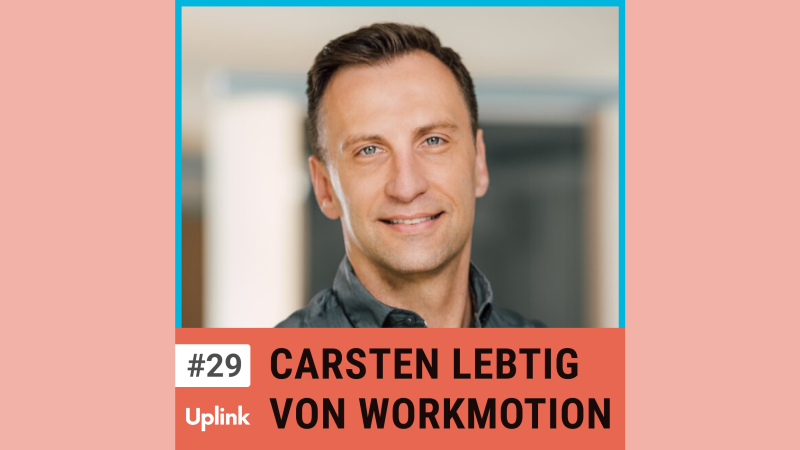

Unser heutiger Gast ist Carsten Lebtig, einer der Gründer von WorkMotion. WorkMotion ermöglicht es Unternehmen, unkompliziert Fachkräfte in über 160 Ländern anzustellen. 
Wir sprechen darüber, wie WorkMotion funktioniert, was Unternehmen vor und nach dem Einstellen von Remote-Mitarbeitern beachten sollten, welche Länder sich besonders für Remote Hiring eignen (und welche nicht), und vieles mehr. 
Nicht zuletzt berichtet Carsten, in welchen Bereichen sein Unternehmen schon KI Tools einsetzt und wie KI seiner Meinung nach den HR und "Global Hiring" Markt in den nächsten Jahren verändern wird.

<!--truncate-->

<video controls="controls" src="https://uplink.tech/rails/active_storage/blobs/redirect/eyJfcmFpbHMiOnsibWVzc2FnZSI6IkJBaHBBcHQxIiwiZXhwIjpudWxsLCJwdXIiOiJibG9iX2lkIn19--63610f824cab0863ae3e4ff7ea98053ffc9dd837/manuel-meurer-carsten-lebtig_full_length%20sep%207,%20%20(1).mp4"></video>

Hier könnt ihr euch die gesamte Episode anhören:

<Embed>https://uplink.tech/podcast/29-carsten-lebtig</Embed>

Und hier findest ihr alle weiteren Episoden unseres Podcasts:

<Embed>https://uplink.tech/podcast</Embed>

Erwähnungen in dieser Episode:

VidYard 
https://www.vidyard.com/

Double Your Profits in Six Months or Less 
https://www.amazon.de/dp/B005PMWM1I/

"Arnold" auf Netflix 
https://www.netflix.com/title/81317673
