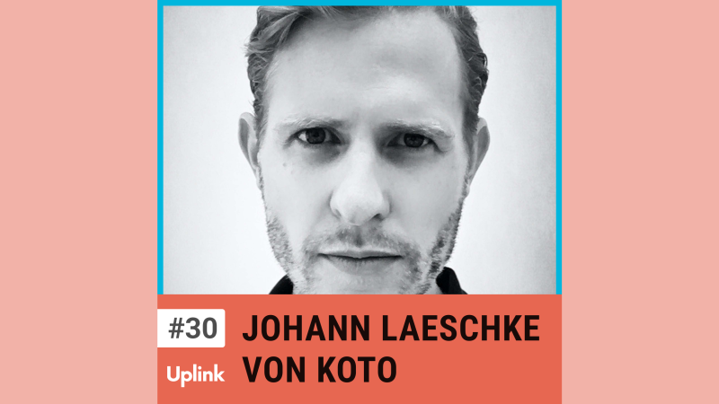

Heute sprechen wir mit Johann Laeschke, seines Zeichens Managing Director des Designstudios Koto. Koto betreut große und kleine Unternehmen bei der Markenfindung - seien es Startups, die eine passende Brand für das eigene Produkt suchen, oder Unternehmen wie Amazon, die neue Services launchen und Koto schon während der Entwicklung mit einbeziehen. 
Johann berichtet, wie sich Koto als mittlerweile globales Unternehmen mit fünf Standorten auf drei Kontinenten organisiert, was eine gute Brand ausmacht und wie sie ihre Kunden in mehreren Phasen durch den Branding Prozess leiten.

<!--truncate-->

<video controls="controls" src="https://uplink.tech/rails/active_storage/blobs/redirect/eyJfcmFpbHMiOnsibWVzc2FnZSI6IkJBaHBBdkoxIiwiZXhwIjpudWxsLCJwdXIiOiJibG9iX2lkIn19--336c8f5bfd4a9fa128db486dc5d890555d0ce0b9/manuel-meurer-johann-laeschke_full_length%20sep%207,%20%20(1).mp4"></video>

Hier könnt ihr euch die gesamte Episode anhören:

<Embed>https://uplink.tech/podcast/30-johann-laeschke</Embed>

Und hier findest ihr alle weiteren Episoden unseres Podcasts:

<Embed>https://uplink.tech/podcast</Embed>

Erwähnungen in dieser Episode:

Fireflies 
https://fireflies.ai/

Medium 
https://medium.com/

Flipboard 
https://flipboard.com/

Artifact News 
https://artifact.news/

Lore Podcast 
https://www.lorepodcast.com/
