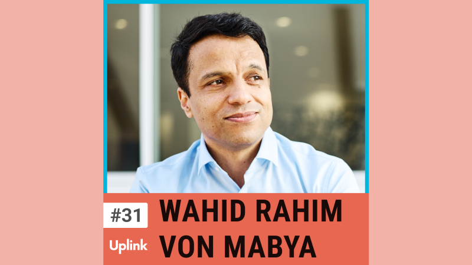

Heute sprechen wir mit Wahid Rahim aus der Uplink Community. Wahid hat vor ca. 15 Jahren Mabya gegründet, einen Marktplatz für den Kauf und Verkauf von digitalen Unternehmen.

Wir sprechen mit ihm über die Gründungsgeschichte von Mabya, wie sich die Art der angebotenen Projekte über die Jahre verändert hat, wie er mit Betrug umgeht und was ein fairer Kaufpreis für ein Web-Projekt ist.

<!--truncate-->

<video controls="controls" src="https://uplink.tech/rails/active_storage/blobs/redirect/eyJfcmFpbHMiOnsibWVzc2FnZSI6IkJBaHBBajU0IiwiZXhwIjpudWxsLCJwdXIiOiJibG9iX2lkIn19--a40b82e3c1380136eb0fb1f86930f44999803d2d/manuel-meurer-wahid_full_length%20oct%209,%20%20(1).mp4"></video>

Hier könnt ihr euch die gesamte Episode anhören:

<Embed>https://uplink.tech/podcast/31-wahid-rahim</Embed>

Und hier findest ihr alle weiteren Episoden unseres Podcasts:

<Embed>https://uplink.tech/podcast</Embed>

Erwähnungen in dieser Episode:

Mabya 
https://www.mabya.de/

Flippa 
https://flippa.com/

JetBrains 
https://www.jetbrains.com/

Doppelgänger TechTalk Podcast 
https://www.doppelgaenger.io/