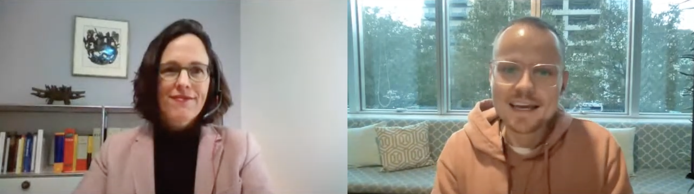

Am 23.11. hatten wir die große Freude, mit [IT-Fachanwältin Julia Gertz](https://www.juliagertz.de/) ein Webinar im AMA ("Ask me anything") Stil zu veranstalten. Dafür haben wir im Vorfeld (und live beim Webinar) Fragen aus der Uplink-Community gesammelt, die Julia mit großer Ausdauer und Expertise beantwortet hat.

Als Fachanwältin für IT-Recht überprüft und entwirft Julia Gertz IT-Verträge, hauptsächlich für IT-Freelancer und mittelständische Unternehmen. Daneben berät sie bei individuellen IT-Rechtsfragen und vertritt Freelancer im Streitfall auch vor Gericht.

<!--truncate-->

<Embed>https://www.youtube.com/watch?v=CJnRz14OUYc</Embed>

Während des Webinars haben wir diese Themen behandelt:

**Wichtige Aspekte in IT-Verträgen**

Julia hebt die Bedeutung von detaillierten Regelungen in IT-Verträgen hervor, insbesondere bezüglich der Abgrenzung von Wartung und Gewährleistung. Sie betont, dass Fehlerbehebung unter Gewährleistung fällt, während Wartungsverträge separate Vereinbarungen benötigen.

**Vertragsgestaltung für Freiberufler**

Sie empfiehlt, zwischen Dienst- und Werkverträgen zu unterscheiden, wobei bei Dienstverträgen die Arbeitszeit und bei Werkverträgen ein konkretes Ergebnis im Fokus steht.

**Bedeutung mündlicher Vereinbarungen**

Julia erläutert, dass mündliche Verträge zwar gültig, aber schriftliche Verträge vorzuziehen sind, um Missverständnisse zu vermeiden, besonders bei komplexen IT-Projekten.

**Rechtsschutz in Projekten**

Sie rät, Verträge sorgfältig zu prüfen und sicherzustellen, dass die Rechte und Pflichten klar definiert sind, um rechtlichen Schutz in IT-Projekten zu gewährleisten.

**Spezielle Klauseln in IT-Verträgen**

Julia spricht über die Notwendigkeit klarer Regelungen bezüglich Gewährleistung, Wartung und der Möglichkeit von Nachverhandlungen.

**Effektiver Wartungsvertrag**

Sie empfiehlt, Wartungsverträge klar von Gewährleistungsansprüchen zu trennen und konkrete Bedingungen wie Reaktionszeiten festzulegen.

**Rechtliche Folgen von Scheinselbstständigkeit**

Julia erklärt, dass Versuche, die Risiken der Scheinselbstständigkeit auf Freiberufler zu übertragen, oft rechtlich unwirksam sind, da sie grundlegende Arbeitnehmerschutzrechte verletzen können.

**Wirksamkeit von Wettbewerbsverboten**

Sie erörtert, dass Wettbewerbsverbote in der Regel durchsetzbar sind, solange sie die wirtschaftliche Freiheit des Freelancers nicht unangemessen einschränken.

**Allgemeine Ratschläge zum Vertragsmanagement**

Julia rät zu ausgewogenen Verträgen, die Fairness und Gleichberechtigung beider Vertragsparteien sicherstellen, insbesondere im Hinblick auf Kündigungsrechte.
