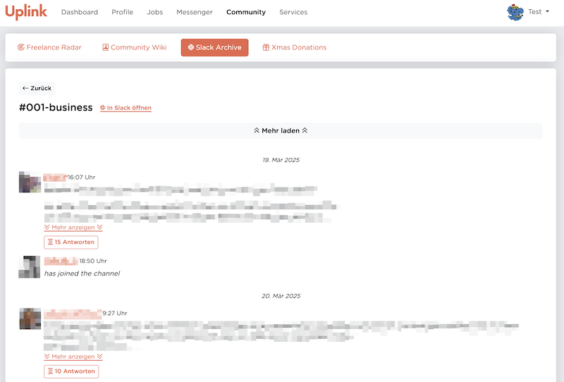

# 🗄️ Slack Archive {#slack-archive}

## 🤔 Was ist das Slack Archive?

Das **Slack Archive** ist eine Datenbank aller Nachrichten aus unserem [Community Slack](../060-community-slack.md), das allen Mitgliedern von Uplink im [Mitgliederbereich](../110-member-area.md) zugänglich ist.

## 🎯 Welches Problem löst es?

Wir nutzen für unseren Community Slack die kostenlose Version von Slack, die u.a. die Beschränkung hat, dass [nur die Nachrichten der letzten 90 Tage angezeigt werden](https://slack.com/intl/de-de/pricing/paid-vs-free).
Alle Nachrichten, die vor mehr als 90 Tagen verschickt wurden, werden von Slack ausgeblendet.

Für unsere öffentlichen Channels heißt das: wertvolle Diskussionen, Links und Tipps aus der Vergangenheit verschwinden aus dem Verlauf!

Noch gravierender ist das Problem aber bei den [Application Channels](../060-community-slack.md#application-channels), die automatisch für jede Bewerbung für einen Job angelegt werden. Dort werden manchmal zu Beginn eines Projekts wichtige Themen besprochen, die auch nach mehreren Monaten noch relevant sind (z.B. Fragen zur Rechnungsstellung oder Vereinbarungen mit dem Kunden) und vom Bewerber und dem Uplink Team eingesehen werden müssen.

**Mit dem Slack Archive stellen wir sicher, dass alle Inhalte dauerhaft erhalten bleiben!**

## 🚀 Wie nutze ich es?

Es gibt verschiedene Möglichkeiten, ins Slack Archive zu gelangen:

1. Im [Mitgliederbereich](../110-member-area.md) findet ihr das Slack Archive unter dem Menüpunkt "Community".
2. In jedem öffentlichen Slack-Channel ist das Slack Archive über "Channel-Lesezeichen" erreichbar:
   
3. An jeder Nachricht im Slack findet ihr nach einem Klick auf die drei Punkte die Option "Open in Slack Archive":
   

## 💡 Best Practices

* Das Slack Archive unterstützt Links zu einem Channel oder auch zu einer einzelnen Nachricht. Diese Links kann man statt der Links zu Channels oder Nachrichten direkt im Community Slack nutzen, um sicherzugehen, dass sie auch nach mehreren Monaten noch erreichbar sind.

## ❓ FAQ

* **Gibt es eine Suchfunktion?** 
  Die Suche ist noch nicht implementiert, steht aber auf unserer Todo-Liste! 🤞

* **Wer hat Zugriff auf welche Channels?** 
  Jeder Nutzer hat Zugriff auf genau die Channels, auf die er auch im Slack Zugriff hat (d.h. denen er beigetreten ist). Insbesondere für private Channels heißt das: **nur die Mitglieder des privaten Channels können die Nachrichten auch im Slack Archive lesen**. 
  Nachrichten aus Slack Chats (nicht Channels) zwischen zwei oder mehr Benutzern werden nie an unsere Server übertragen und können daher im Slack Archive nicht angezeigt werden.

* **Was passiert, wenn ein Nutzer seinen Slack-Account deaktiviert?** 
  Deaktivierte Nutzer und deren Nachrichten werden im Slack Archive nicht angezeigt und durch `[Nutzer deaktiviert]` ersetzt.

## 📚 Weiterführende Links

* https://slack.com/intl/de-de/pricing/paid-vs-free
